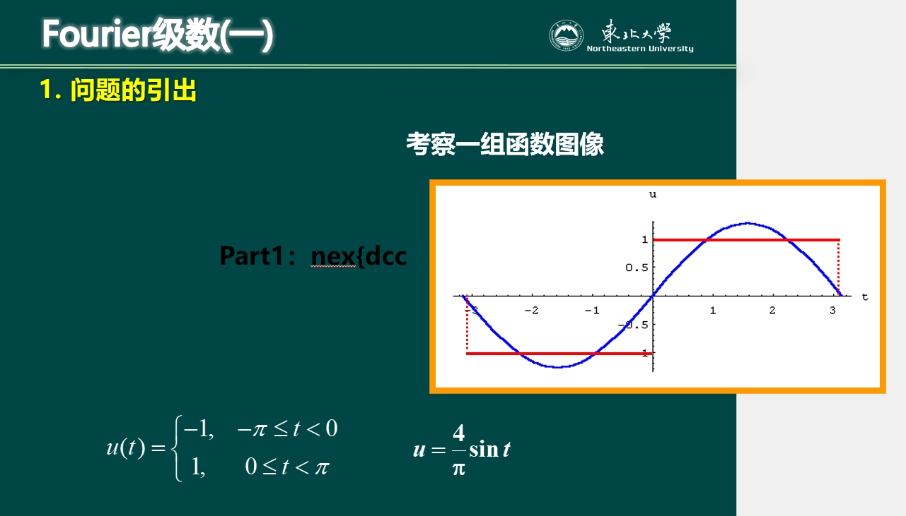
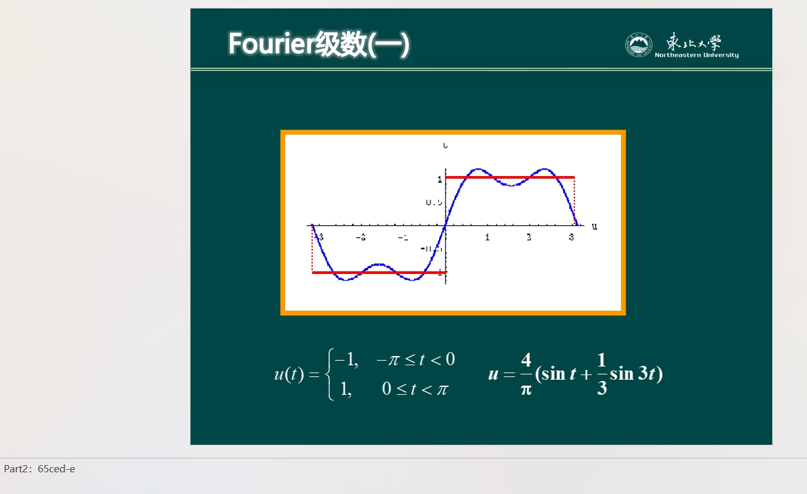
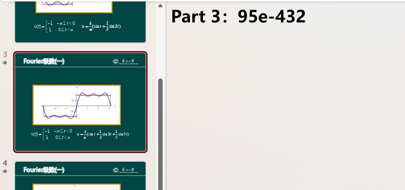
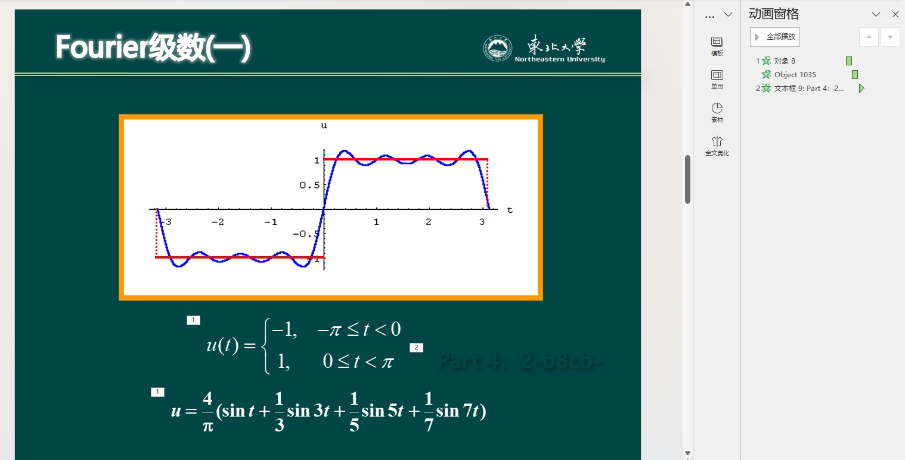
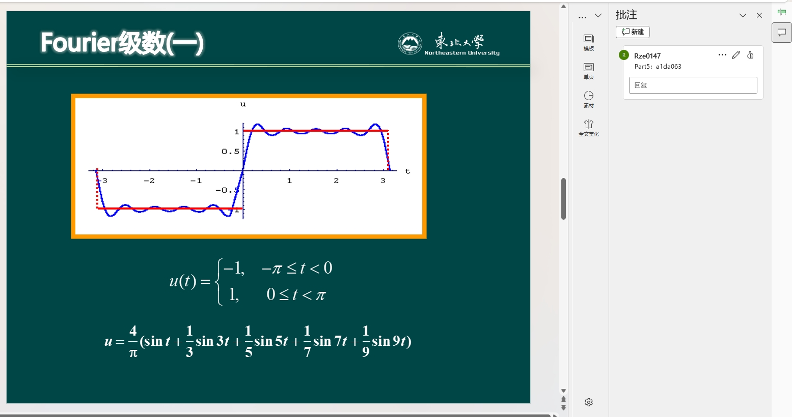
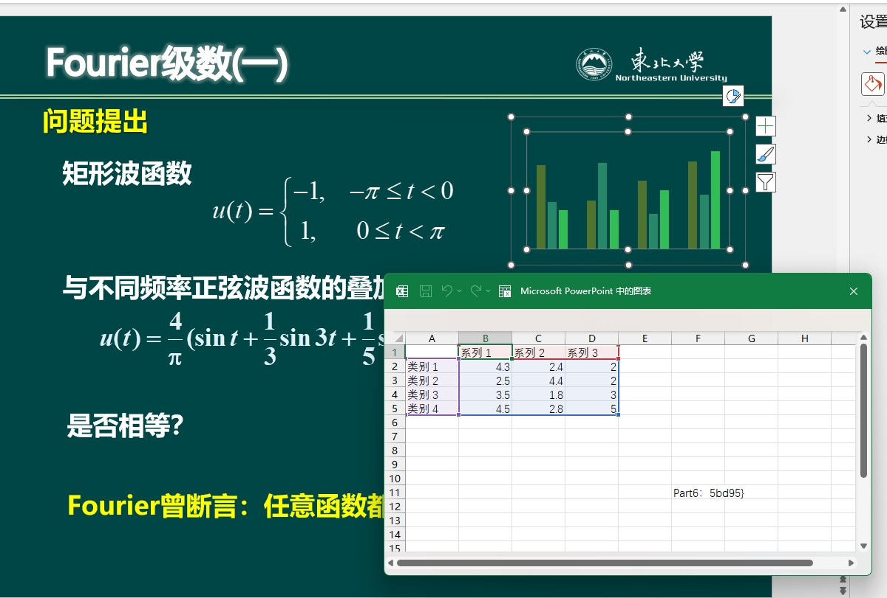

## 【简单】高数课 我挚爱的时光~

背景：今年全国大学生信息安全竞赛出了道 PPT 的题，这次比赛也搞了道 PPT 的题，有兴趣的可以去搜搜那道题，藏的位置更多，地方更隐秘，而且还有些加密

> 【神秘文件】附件
> 链接：https://pan.baidu.com/s/12JWWpnCj33HctMOxZ4l-NA?pwd=57qf 
> 提取码：57qf

---

Flag 共分为六个部分，1-6 页每页一个部分：

1. 第一页的函数图像底下

2. 第二页的备注中

3. 可以注意到第三页和其它页相比，不在中间位置，因此可以猜测 ppt 外左上角有东西

4. 第四页中是和背景色相同的字体色，可以通过动画窗格看到

5. 第五页的批注中
   

6. 第六页出现了一个没有用的图表，右键图表 -> 编辑数据，把它拉大点就能看到
   

> 很多人找不到第六部分在哪，在给提示的时候我把第五、六部分的顺序记反了，真是不好意思hhhh
