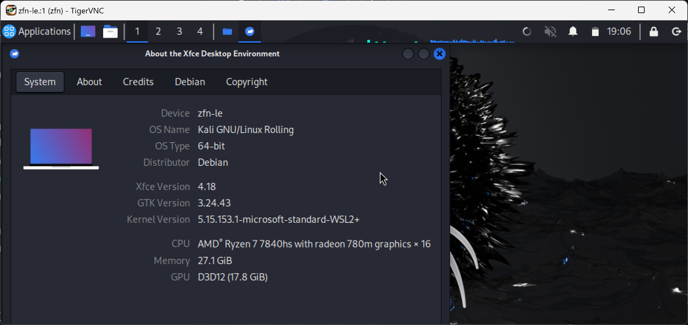

[toc]
# WSL
只讨论WSL2。如过你需要自己搜索额外的教程，请注意教程发布时间，以一年内为佳，两年内也行。尽量只参考官方文档。

## 安装
在最新的系统中，理论上只需一行命令（这行命令会自动启用相关“Windows功能”，无须在控制面板中进行额外操作）  
```
wsl --install -d kali-linux
```
如果你遇到问题，参考：
- <https://www.kali.org/docs/wsl/wsl-preparations/>
- <https://learn.microsoft.com/zh-cn/windows/wsl/install>

### 改变安装路径
TODO: 来个人翻译成中文
参考：<https://www.kali.org/docs/wsl/wsl-preparations/#import-rootfs>

### 下载完整的kali工具
TODO: 来个人翻译成中文
- <https://www.kali.org/docs/troubleshooting/common-minimum-setup/>
- <https://www.kali.org/docs/general-use/metapackages/>

## 文件互通
待补全

### VS Code无缝编辑
当你的Windows系统中存在VS Code时，你可以在WSL中像vim一样调用它，把vim扔掉吧。
```
code [file-to-edit]
```

## 网络配置
待补全

## 图形界面（KEX）
TODO: 来个人翻译成中文
你可以一键启动Kali Linux的图形界面来运行图形程序。  
  

参考：<https://www.kali.org/docs/wsl/win-kex/>  
