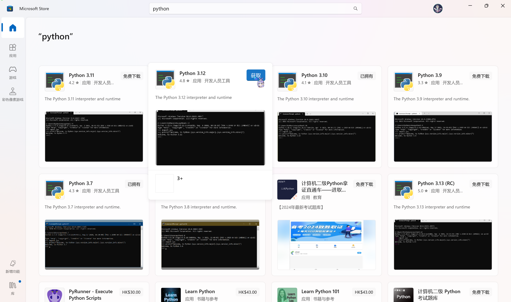
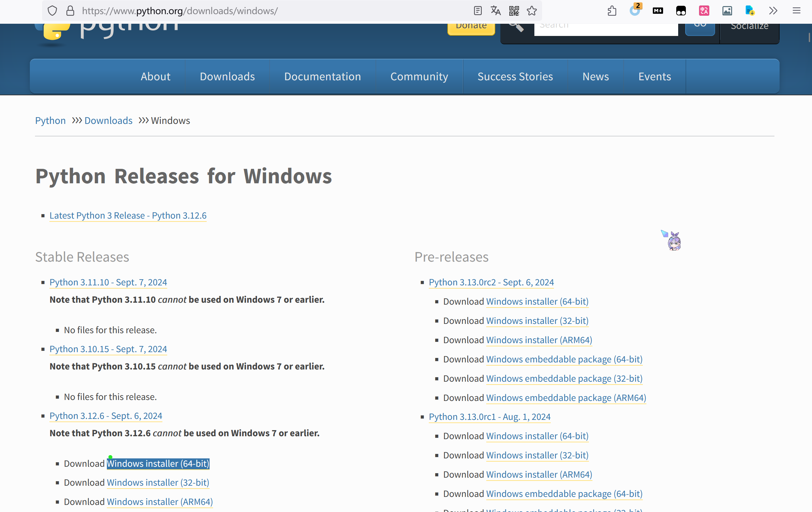

# Python

## 方法1
打开Microsoft Store（微软商店）,搜索Python，选择你喜欢的版本（Python 3.xx），安装。

## 方法2
打开<https://www.python.org/downloads/windows/>，找到你喜欢的版本，点击“Windows installer (64-bit)”来下载和安装

## Python常用包
[链接](../../py_packages.md)