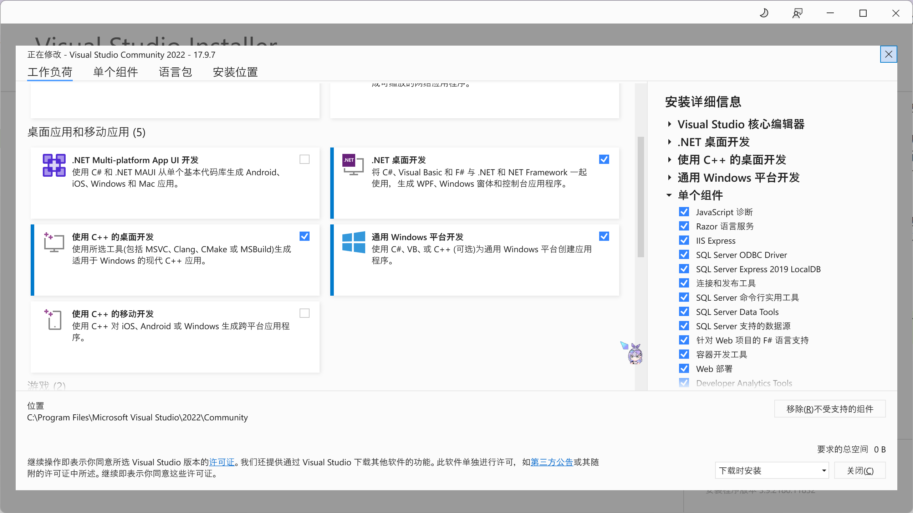

# Visual Studio

**（省流：Windows系统下进行C++, .net系列语言【C#, F#, VB】开发的IDE。主要用于编写Windows下的原生软件。也能用来写Python，Web，移动端等...但我建议只在写C++和.net时用它）**  

Microsoft Visual Studio（视觉工作室，简称VS或MSVS）是微软公司的开发工具包系列产品。VS是一个基本完整的开发工具集，它包括了整个软件生命周期中所需要的大部分工具，如UML工具、代码管控工具、集成开发环境（IDE）等等。所写的目标代码适用于微软支持的所有平台，包括Microsoft Windows、Windows CE、.NET、.NET Framework、.NET Compact Framework和Microsoft Silverlight。  

而Visual Studio .NET是用于快速生成企业级ASP.NET Web应用程序和高性能桌面应用程序的工具。Visual Studio包含基于组件的开发工具（如Visual C#、Visual J#、Visual Basic和Visual C++），以及许多用于简化基于小组的解决方案的设计、开发和部署的其他技术。   

## 安装

打开<https://visualstudio.microsoft.com/zh-hans/>，点击“Visual Studio”。启动安装程序，安装时选择“使用C++的桌面开发”以及其他你喜欢的项目。  
注意，即使修改了安装位置，仍然会占用部分C盘空间。  

## 打开项目

文件夹中存在以sln为扩展名的文件即为Visual Studio的项目文件，双击打开即可。  
运行项目只需点击那个绿色的播放按钮。