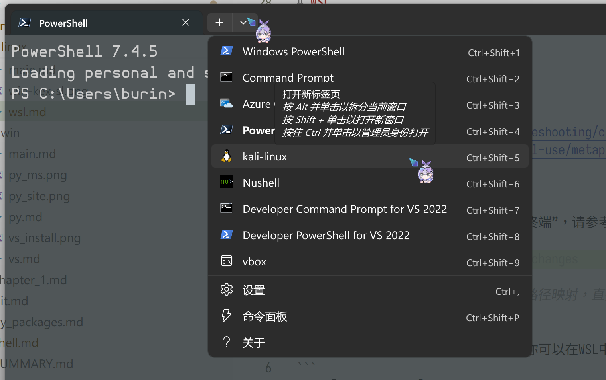
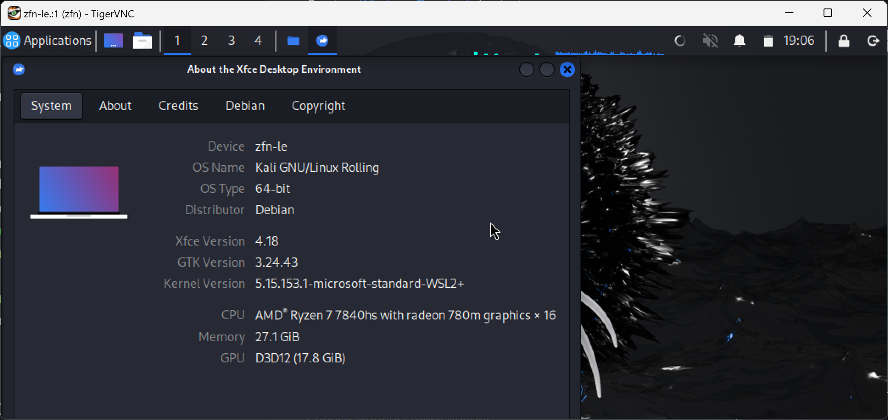

# 安装方式-WSL

只讨论WSL2。如果你需要自己搜索额外的教程，请注意教程发布时间，以一年内为佳，两年内也行。尽量只参考官方文档。

[toc]

## 安装
在最新的系统中，理论上只需一行[shell](../../shell.md)命令（这行命令会自动启用相关“Windows功能”，无须在控制面板中进行额外操作）  
```
wsl --install -d kali-linux
```
如果你遇到问题，参考：
- <https://www.kali.org/docs/wsl/wsl-preparations/>
- <https://learn.microsoft.com/zh-cn/windows/wsl/install>

### 改变安装路径

<!--TODO: 来个人本地化一下-->

参考：<https://www.kali.org/docs/wsl/wsl-preparations/#import-rootfs>

### 下载完整的kali工具

<!-- TODO: 来个人本地化一下 -->

参考：

- <https://www.kali.org/docs/troubleshooting/common-minimum-setup/>
- <https://www.kali.org/docs/general-use/metapackages/>

## 安装后如何启动

在shell这一章节中你应该已经安装了“终端”，请参考下图。



## 文件互通

Windows的cdef盘在/mnt/{c,d,e,f}下

Windows的主目录可能在~/winhome下

可直接执行Windows path中的程序，记得加上.exe

### VS Code无缝编辑

当你的Windows系统中存在VS Code时，你可以在WSL中像vim一样调用它，把vim扔掉吧。

```
code [file-to-edit]
```

## 网络配置

官方文档：<https://learn.microsoft.com/zh-cn/windows/wsl/networking>

一些提示：

nat, mirrored：理论上两种模式都可以直接访问wsl内开的端口。以下是启用mirrored的当前优势：

- IPv6 支持
- 使用 localhost 地址 127.0.0.1 从 Linux 内部连接到 Windows 服务器。 不支持 IPv6 localhost 地址 ::1
- 改进了 VPN 的网络兼容性
- 多播支持
- 直接从局域网 (LAN) 连接到 WSL


auto proxy：自动使用Windows开的科学上网，前提是运行的程序走系统代理


## 图形界面（KEX）

<!-- TODO: 来个人本地化一下， -->

参考：<https://www.kali.org/docs/wsl/win-kex/>

你可以一键启动Kali Linux的图形界面来运行图形程序。

  


