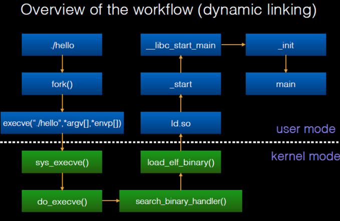

# Pwn 程序执行流程

> 刚入门的同学可以看一眼就过，入门不会涉及太多，随着学习的深入，对各个部分都会有了解的。

一个程序从源代码到运行，需要经历很多步骤：

编写源代码->编译->汇编->链接->装载->运行

链接部分执行完毕后，你将得到一个可执行程序(关于这些部分都干了什么，详见编译原理课程)

装载运行流程如下：

1. 在linux控制台程序[bash]中输入./hello
2. bash会调用fork函数，并执行一个名为sys_execve的系统调用。
3. 此时发生软中断，CPU转到内核空间执行中断程序do_execve，将程序加载到内存中
4. 中断恢复，程序控制权交给装载器ld，由装载器执行后续的操作
5. 装载器初始化，并动态链接C标准库，然后跳到程序入口点_start
6. 运行C标准库中的初始化函数
7. 初始化完毕，C标准库调用main函数

后续：

1. main函数返回到C标准库
2. C标准库使用系统调用sys_exit
3. 此时发生软中断，CPU转到内核空间执行中断程序do_exit，将程序卸载
