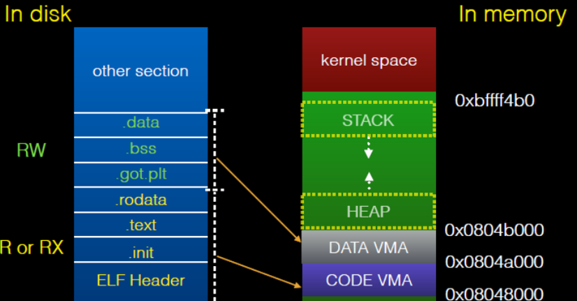

# Pwn 内存映射

程序是有结构的，在windows系统上，可执行程序是PE文件结构(后缀.exe)，在linux系统上，可执行程序是elf文件结构(通常没有后缀)

图的左侧是程序存储在磁盘中的排列格式，当程序被加载，右边就是程序在内存中的形式。右边的结构相当重要。

> 关于elf文件结构不需要了解太多，当涉及到相关知识点可以搜索

右图从高地址到低地址依次是：

1. 内核空间
2. 程序栈空间
3. 动态链接库
4. 堆空间
5. 程序数据段
6. 程序代码段

每个部分都有访问权限，比如程序代码段不可写，但可读可执行；程序栈空间可读可写，但不可执行。

程序运行的局部变量存储于程序栈空间，全局变量存储于程序数据段，程序代码位于代码段，动态分配的空间在堆空间。程序的函数调用关系会存储在程序栈空间。

基于此，我们可以思考如何破坏一个程序。例如一次不限制数据的读入，如果数据存储位置在栈，那么栈上原本正常的数据就会被覆盖，从而造成程序错误。如果数据存储位置在堆空间或者数据段，同样有可能覆盖原本正常的数据。
> 设想当一个指针被覆盖，那么它可以被指向任何地方，程序后续在使用该指针的时候就会发生某些错误。

### 下一章节： [Pwn —— 漏洞与利用](./vuln.md)