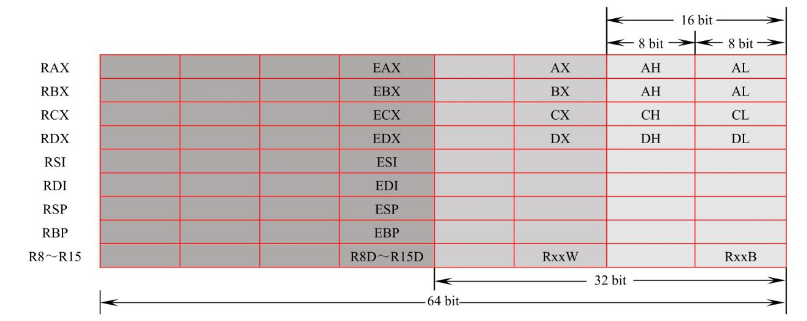
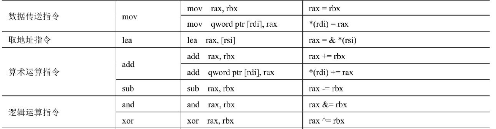
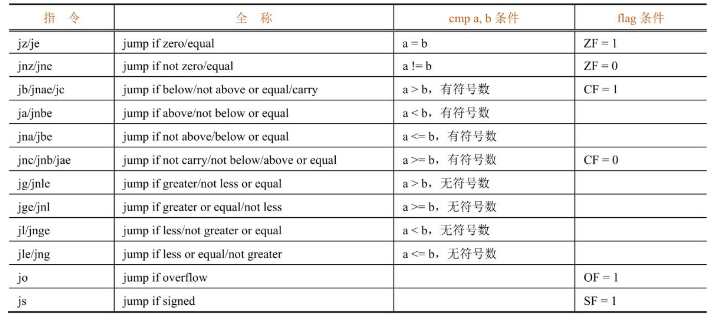
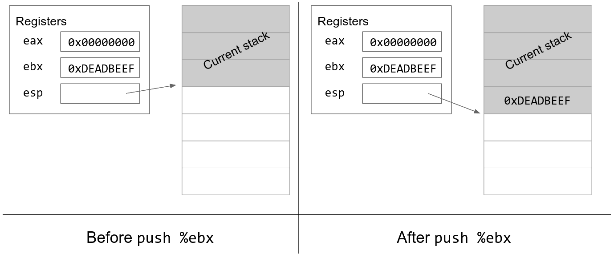
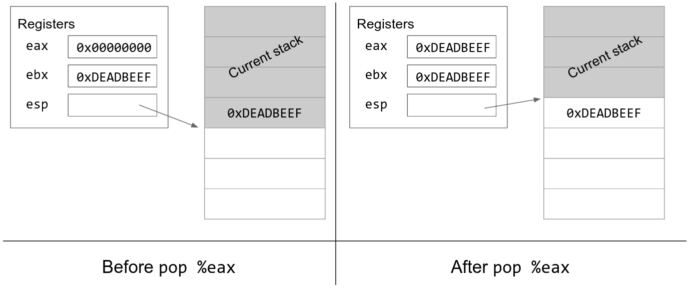
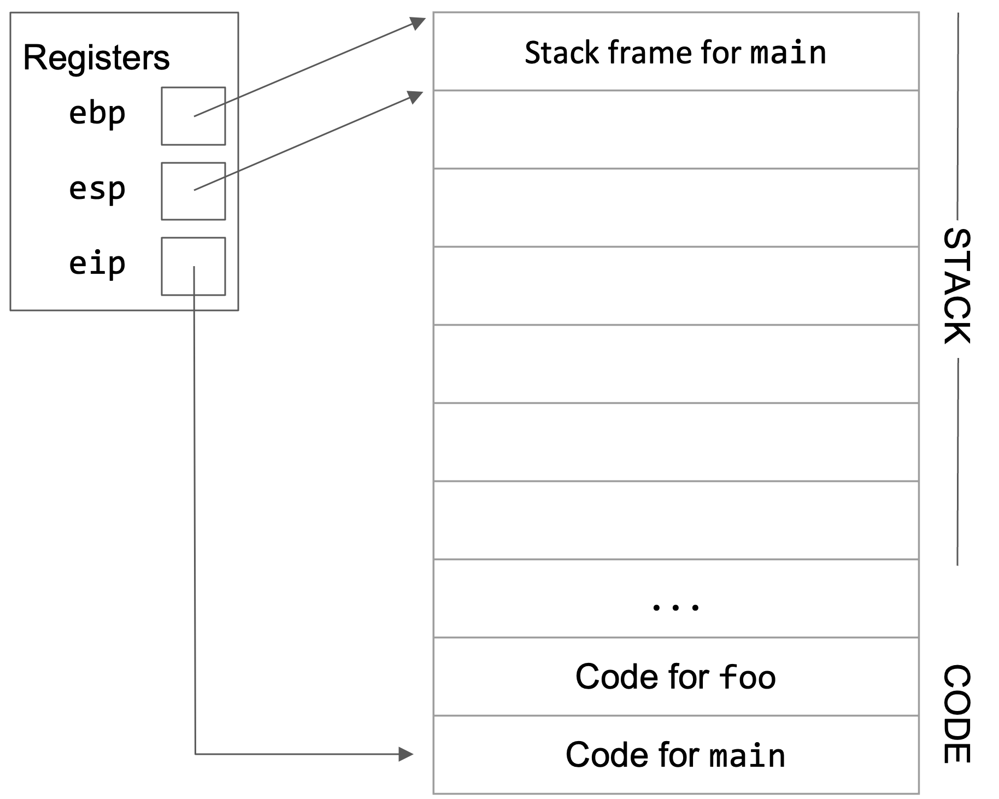
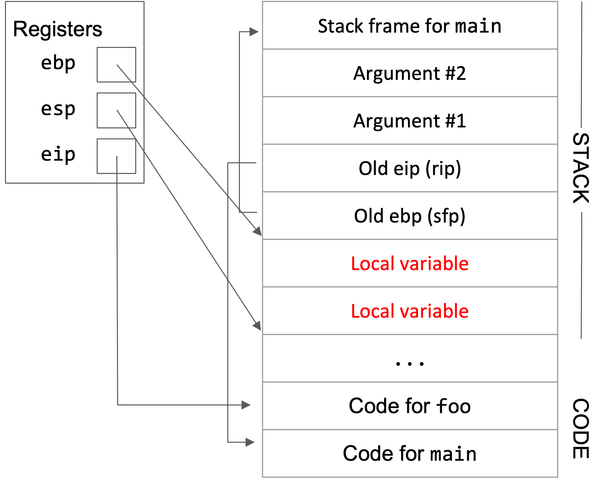
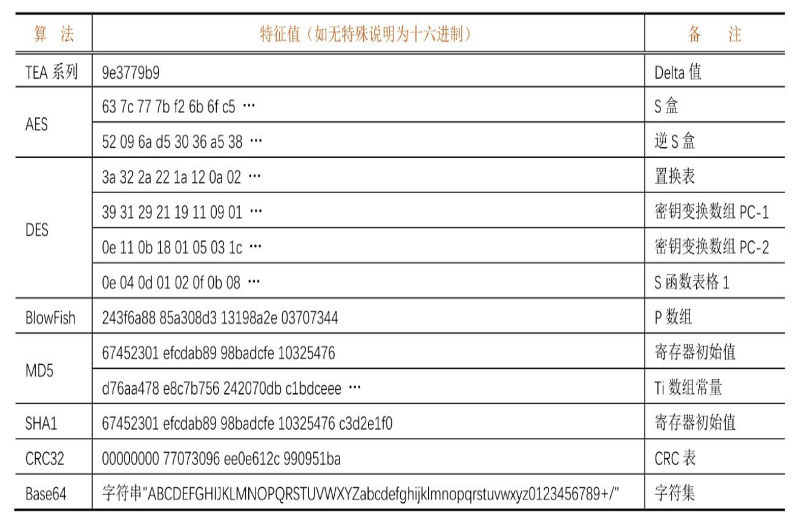
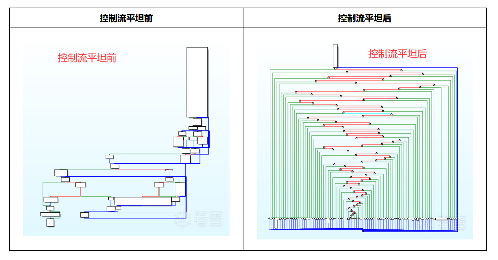
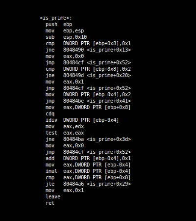

# Reverse

by zfn

这篇是把某次的slides直接拿过来了，修复了一下格式

还欠缺很多IDA等工具的实际演示，因为当时讲的时候是现场演示的x

[toc]

## 附件下载
**题目1-3（第x波实战）、壳篇、z3篇、符号执行篇(angr笔记)在单独的文件里，[点击下载](./re.zip)**

如果某一节内容很少，可能相关内容在附件里


## 什么是逆向工程
你说的对，但是《逆向工程》是由网络空间安全自主研发的一款全新解谜类竞技游戏。游戏发生在一个被称作「操作系统」的虚拟空间，在这里，被二进制代码选中的人将被授予「反编译器」，引导逆向之力。你将扮演一位名为「逆向工程师」的神秘角色，在破解代码的旅途中邂逅各种挑战和谜题，和他们一起找回失散的加密算法——同时，逐步发掘「flag」的真相。


## 什么是逆向工程
软件代码逆向主要指对软件的结构，流程，算法，代码等进行逆向拆解和分析。  
一般，CTF中的逆向工程题目形式为：程序接收用户的一个输入，并在程序中进行一系列校验算法，如通过校验则提示成功，此时的输入即flag。这些校验算法可以是已经成熟的加解密方案，也可以是作者自创的某种算法。比如，一个小游戏将用户的输入作为游戏的操作步骤进行判断等。这类题目要求参赛者具备一定的算法能力、思维能力，甚至联想能力。

---

## 程序/可执行文件

+ 一个操作系统中的对象 (文件)
+ 一个字节序列
+ 一个描述了状态机初始状态的数据结构
  - 状态机初始状态的描述
    - 内存中的各段的位置和权限
    - 入口点
    - 寄存器和栈由操作系统决定
  - 状态迁移的描述
    - 代码


---

### 可执行文件中的基本结构
不同操作系统对应的可执行文件的结构通常不同（如Windows的PE文件和Linux的ELF文件），但却有很多部分在本质上是相似的。这里的例子适用于常见的原生二进制程序（反例：Java, Android）。

#### section
section 是编译器生成的，用于组织代码和数据的逻辑部分。每个 section 具有特定的属性和用途，比如代码段、数据段、符号表等。常见的 section 包括 .text（包含可执行代码）、.data（初始化的数据）、.bss（未初始化的数据）、.rodata（只读数据）等。
#### segment 
segment是链接器和操作系统关注的，是程序加载时的内存映射单元。segment 是将多个 section 合并到一起，一般连续的、权限相同的节会被合并。
#### 导入表、导出表
需使用的来自其他动态链接库中的项目（例如函数）  
以及  
作为动态链接库提供给其他程序的项目


#### 相关工具

- PE文件：studype++
- ELF文件：readelf
- 通用：Detect it easy


---

### 特殊的可执行文件/题目类型
<br>

#### 特殊系统
- Android，iOS，OS X
- riscv，龙芯

#### 源代码
- 如经过混淆的php文件，powershell文件，常常作为木马上传。
- web网站中打包后的js文件。
- 利用了特殊机制（操作系统、并发...）[JavaCPScript - deadsec ctf](https://cut-lifeboat-494.notion.site/Dead-sec-CTF-bc6a451980bc4b53bafe4d765a6aef44)

#### 字节码（VM)
- 常见的：Java, Python, lua...
- 其他：智能合约，yara规则...


## 从x86(_64)架构开始 

---

### 反汇编/反编译工具
首先准备一套覆盖逆向工程全流程的工具，包括反汇编、反编译（生成伪代码）、控制流图分析、自动化处理脚本、插件支持。

- IDA
- Ghidra
- Binary Ninja
- radare2/rizin

---

### 调试工具
实际上上面的工具是内置调试功能的，但功能不太丰富，容易崩溃，插件支持少，卡

- Linux：gdb
  - 使用此脚本一键安装gef与pwndbg：<https://github.com/apogiatzis/gdb-peda-pwndbg-gef>
- Windows: x64dbg，windbg
  - 注：ollydbg停更多年，不支持64位，基本上已被取代


### x86_64汇编速成

---

#### 寄存器

寄存器（Register）是CPU的组成部分，是有限存储容量的高速存储部件，用来暂存指令、数据和地址。一般的IA-32（Intel Architecture，32-bit）即x86架构的处理器中包含以下在指令中显式可见的寄存器：

- 通用寄存器EAX、EBX、ECX、EDX、ESI、EDI。

- 栈顶指针寄存器ESP、栈底指针寄存器EBP。

- 指令计数器EIP（保存下一条即将执行的指令的地址）。

- 段寄存器CS、DS、SS、ES、FS、GS。（可以忽略他们）

对于x86-64架构，在以上这些寄存器的基础上，将前缀的E改成R，以标记64位，同时增加了R8～R15这8个通用寄存器。另外，对于16位的情况，则将前缀E全部去掉。

对于通用寄存器，程序可以全部使用，也可以只使用一部分。使用寄存器不同部分时对应的助记符见图5-1-1。其中，R8～R15进行拆分时的命名规则为R8d（低32位）、R8w（低16位）和R8b（低8位）。

---

可以将寄存器理解为预先定义好的变量，这变量没有类型，执行操作时只有长度的区别。


---

#### 内存和寻址
寻址=解引用一个指针

| 寻址方式    | 示例              | C 语言示例                                                 |
| ------- | --------------- | ------------------------------------------------------ |
| 直接寻址    | `[1000h]`       | `int* ptr = (int*)0x1000; int val = *ptr;`             |
| 寄存器间接寻址 | `[RAX]`         | `int* ptr = (int*)rax; int val = *ptr;`                |
| 基址寻址    | `[RBP+10h]`     | `int* ptr = (int*)(rbp + 0x10); int val = *ptr;`       |
| 变址寻址    | `[RDI+10h]`     | `int* ptr = (int*)(rdi + 0x10); int val = *ptr;`       |
| 基址加变址寻址 | `[RBX+RSI+10h]` | `int* ptr = (int*)(rbx + rsi + 0x10); int val = *ptr;` |

---

#### 基本运算



---

#### 条件跳转

每次进行运算时，不仅会改变目标中的值，还会影响标志位

- AF：辅助进位标志（Auxiliary Carry Flag），当运算结果在第3位进位的时候置1。
- PF：奇偶校验标志（Parity Flag），当运算结果的最低有效字节有偶数个1时置1。
- SF：符号标志（Sign Flag），有符号整形的符号位为1时置1，代表这是一个负数。
- ZF：零标志（Zero Flag），当运算结果为全零时置1。
- OF：溢出标志（Overflow Flag），运算结果在被操作数是有符号数且溢出时置1。
- CF：进位标志（Carry Flag），运算结果向最高位以上进位时置1，用来判断无符号数的溢出。

但我们不用记这些

---



---


jump里  
- n: not
- e: equal
- z: zero
- g: greater
- l: less
- b: blow
- a: above

a,b有符号  
g,l无符号

---


#### 函数调用

##### 栈
x86的栈是从顶往下塞东西的。  
ebp是基指针，它存储当前栈顶地址。（什么叫当前栈？之后解释 ）  
esp是栈指针，它存储当前堆底地址。





---


##### 调用过程

在 x86 架构中，ESP（中保存的地址）和EBP（中保存的地址）之间的区域通常称为栈帧。栈帧是每个函数调用时在栈上分配的一块内存，用于保存函数的局部变量、返回地址、传递的参数以及保存调用者的寄存器状态。

更详细的：<https://textbook.cs161.org/memory-safety/x86.html#27-x86-calling-convention>







---

#### 参数

- x86 32位架构的调用约定
  - __cdecl：参数从右向左依次压入栈中，调用完毕，由调用者负责将这些压入的参数清理掉，返回值置于EAX中。绝大多数x86平台的C语言程序都在使用这种约定。
  - __stdcall：参数同样从右向左依次压入栈中，调用完毕，由被调用者负责清理压入的参数，返回值同样置于EAX中。Windows的很多API都是用这种方式提供的。
  - __thiscall：为类方法专门优化的调用约定，将类方法的this指针放在ECX寄存器中，然后将其余参数压入栈中。
  - __fastcall：为加速调用而生的调用约定，将第1个参数放在ECX中，将第2个参数放在EDX中，然后将后续的参数从右至左压入栈中。
- x86 64位架构的调用约定
  - Microsoft x64位（x86-64）调用约定：在Windows上使用，依次将前4个参数放入RDI、RSI、RDX、RCX这4个寄存器，然后将剩下的参数从右至左压入栈中。
  - SystemV x64调用约定：在Linux、MacOS上使用，比Microsoft的版本多了两个寄存器，使用RDI、RSI、RDX、RCX、R8、R9这6个寄存器传递前6个参数，剩下的从右至左压栈

---

## 第一批实战

+ Reversing-x64Elf-100: 简单  
+ re5-packed-movement：了解ida脚本  
  IDA python: <https://www.yunyawu.com/2020/06/28/ida-python%E5%AD%A6%E4%B9%A0/>
+ encrypt：搜索加密算法





---


## 代码保护

---


### 自修改
在运行时修改自身代码，从而使得程序实际行为与反汇编结果不符，同时修改前的代码段数据也可能非合法指令，从而无法被反汇编器识别。

---


### 花指令
花指令（junk code）是一种专门用来迷惑反编译器的指令片段，这些指令片段不会影响程序的原有功能，但会使得反汇编器的结果出现偏差，从而使破解者分析失败。比较经典的花指令技巧有利用 jmp 、call、ret 指令改变执行流，从而使得反汇编器解析出与运行时不相符的错误代码。

---


### 壳

*附件中有手动脱壳教程* [附件]](#附件下载)

把代码藏在数据里，运行时再解密/解压到代码段（这个segment也是现场创建的）

建议用工具，不要手动脱，这边演示一下win和linux的upx。  
windows: scylla  
linux: coredump(`echo 0xff > /proc/self/coredump_filter`)  


工具脱：
```
upx -d [filename]
```

---


### 虚拟机

虚拟机就是要去模仿一个机器，让机器去执行一个程序  
一般包括指令序列、存储（堆栈、寄存器）  
<https://bbs.kanxue.com/thread-267670.htm>

---


### 混淆
把代码变成狗看了都摇头的样子。强烈建议没有现成的工具就放弃。

---

#### ollvm
最直观的变化是控制流平坦化，但其实还有别的功能（虚假控制流，指令替换）。  
<https://github.com/cq674350529/deflat>  
<https://oacia.dev/ollvm-study/>  


---


##### movfuscator 
工具：<https://github.com/leetonidas/demovfuscator>





### 反调试

+ Windows: 直接在x64dbg上装scylla hide
+ Linux: 请看文章：<https://xz.aliyun.com/t/6882>

---

## 第二波实战
+ EASYHOOK 自修改
+ oflo花指令+自修改 <https://ctf-wiki.org/reverse/obfuscate/junk-code/#n1ctf2020-oflo>
+ pack.exe：windows upx壳
+ a.out：linux upx壳
+ EzMachine: vm

---


## 高级技巧

---

### Hook

Hook 是在指令的关键位置插入特定代码，以干预程序原有的执行流程，实现拦截目标进程运行过程的关键信息改变目标进程原本执行流程等目的。

[题目3](#附件下载)中的TraceMe和hooking.js是使用frida框架的例子

---

### 约束求解
Z3 是一个微软出品的开源约束求解器，能够解决很多种情况下的给定部分约束条件寻求一组满足条件的解的问题。

```python
from z3 import *

x = Int('x')
y = Int('y')
solve(x > 2, y < 10, x + 2*y == 7) 
```

[z3.ipynb和题目3：useZ3](#附件下载)

---

### 符号执行

符号执行就是在运行程序时，用符号来替代真实值，目的（可以）是探究通过各种分支最终抵达某个程序状态的条件。符号的概念更接近于（对某个寄存器/某段内存的）一组约束，而不是具体的值。

[笔记(angr)和题目3：angr_ctf](#附件下载)