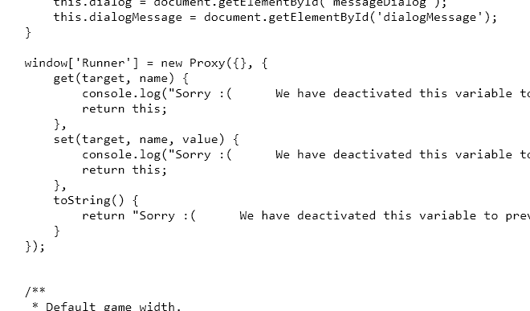
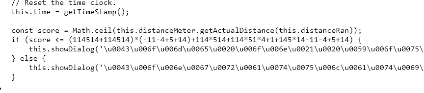
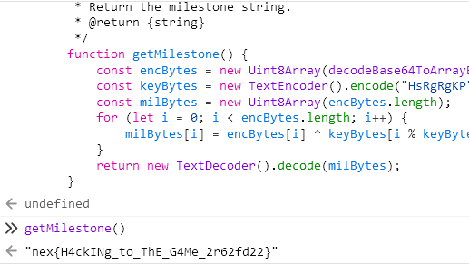
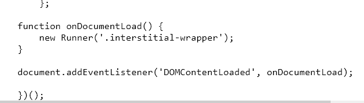
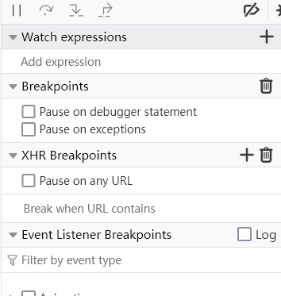
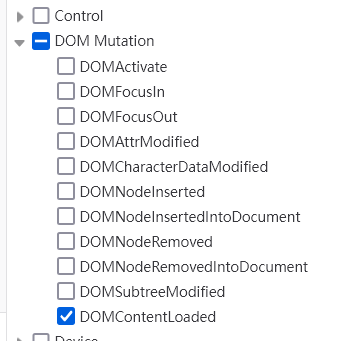
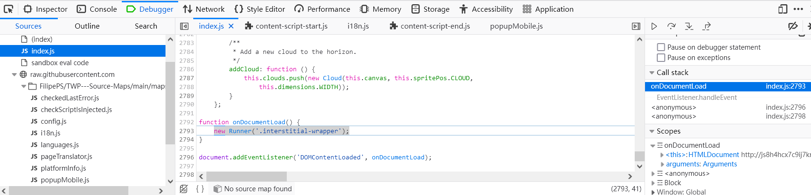
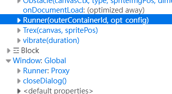
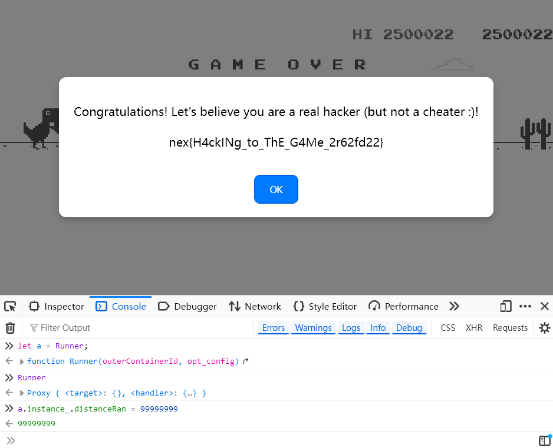

# 【中等】来自远古小恐龙的挑战书

出题组为了给大家整点简单又好玩的题，可谓是费劲了心思，甚至不惜在题面里整上了花里胡哨的排版。本题作为**“游戏”系列**的第一题，本来是可以整一些大作的，比如 GameMaker Studio。但是我一看这生成出来代码又是 webpack 又是 gms 自定义逻辑，完全不是人能看的，遂放弃之，采用了开源、更加简单的替代品。chrome://dino 相信是很多同学在上信息课时的娱乐方式，也算是家喻户晓了。本题的构想是引导玩家看懂 JS 代码，并使用 浏览器的 Console 控制台 功能进行作弊。


当然，什么都不改的话，一个 ```Runner.instance_.distanceRun = 99999999``` 就完事了，这显然**太简单**，于是我在代码里把原本下放到 window['Runner'] 里的实例修了。



删去该行代码后，由于 Runner 是在 ```(function () {  })()``` 里面构造的，**作用域**仅限于此，自然外边就访问不到了。


我相信各位大多数采用的解法都是肉眼或者 AI 观察法，一下就定位到了这段看起来**非常可疑**的代码上。




无论是利用 Burpsuite 或者直接下载网站然后**替换** JS 该行的**检测逻辑**，还是把这个复制出来，粘到控制台里**执行**，都是预期的解法。只不过我没想到大家或者 AI 眼睛看得也太精了，至少直接搜 flag 或者那个框的提示词文本都是找不到这里的。




出题人的原本的打算呢，是教会大家使用 **debugger** 功能。但是善良的出题人还是手软了，没有给 JS 上加密。大家可以想一想，如果到这里（JS 的末尾）为止，上面有关 Runner 实际的代码全部都被加密了的话，本题又应该怎么做呢？




不知道大家是否使用过这个在浏览器 **Debugger** 一栏右侧的小功能块。




我们把 **DOMContentLoaded** 勾上，再刷新，会发生什么呢？




在经历过几个插件之后（按 Resume F8 继续），会发现我们成功断在了**创建新 Runner 实例**的这一行。（或者可以直接在 Line 2793 处右键 Add Breakpoint）




查看一下**变量 Scopes**，底下 window['Runner'] 是被替换过的 Proxy 对象，而上面那个 <anonymous> 作用域的 Runner 自然是在 DOM 树中新创建的那个 Runner 实例对象！




在控制台中，保持断点的状态，我们把这个 Runner **从当前的作用域中提取出来**，即 ```let a = Runner;``` ，然后再继续，便可以跟最开始最简单的方法一样开挂了！




思考题：若整个 JS 文件都被经过很强的加密了，又该怎么办？可以试着在 DOM 点击右键，Break on Subtree Modification，还是能在 Runner 内的某个地方下下断点，自然能获取其作用域。当然，这时候的变量名跟函数名就不一定会那么好看了，关于这一点，还只能自求多福 :)