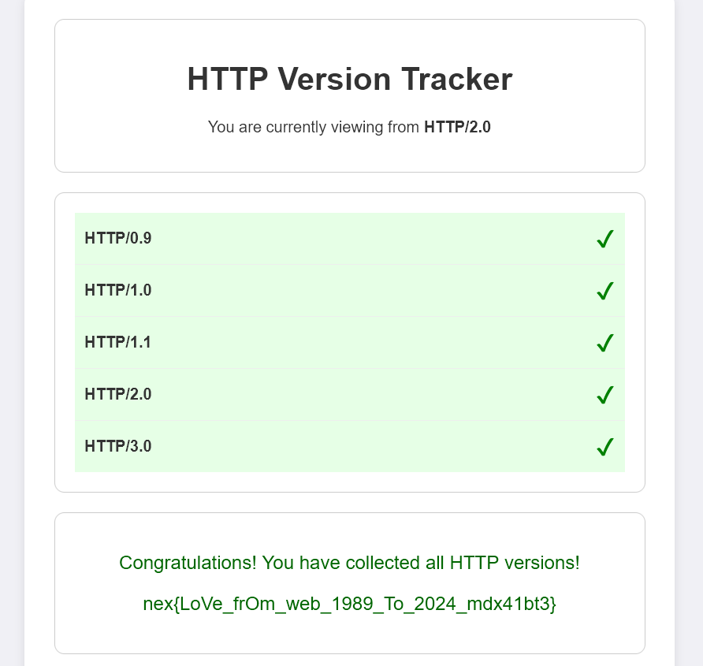
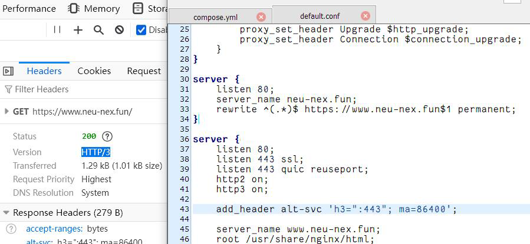

# 【中等】 It's all about HTTP

出题组为了给大家整点好玩又具有实际意义的题，可谓是费劲了心思。说到 Web/Network，那么 HTTP 协议肯定是绕不开的一环。但是一上来就让大家开始研究什么 SSRF、解析差 之类的难度也太高了，便参考 2023 Hackergame 的那道 HTTP Status Code 集邮，结合 HTTP 的发展历史背景，让大家体验了一下 HTTP 各版本协议的差别。

HTTP 演变的几个关键历史节点，善良的出题人也已经在题面里给出提示了。

**1991 年，HTTP/0.9** ：使用 TCP 协议发送  ```GET /```  并按下回车（```\r\n```）即可，没有任何 HTTP Header 。

**1996 年，HTTP/1.0** ：明确了**请求方法**、**状态码**和**头部信息**，它们仍是至今 HTTP 协议的标准结构。使用 TCP 协议发送 ```GET / HTTP/1.0``` 并按下两次回车（```\r\n```）即可。

**1997 年，HTTP/1.1** ：影响深远，扩展了 **Pipelining**、**Chunked Encoding** 等关键特性，时至今日仍在被广泛运用。使用 TCP 协议发送 ```GET / HTTP/1.1``` 并按下回车（```\r\n```）之后还不行，需要发送一个关键的 HTTP 头 ```Host: localhost``` 然后再按下两次回车（```\r\n```）。当然，其实直接使用 http:// 协议在现代浏览器打开就可以了，其默认采用 HTTP/1.1 。

**2015 年，HTTP/2** ：中间隔的这十几年，见证了互联网的兴衰史。P2P、ADSL 逐渐退出人们的日常生活，而移动设备、物联网开始取代传统 Web 。最值得注意的是，HTTP/2 终于不再采用简单的 ASCII 编码，而是一个**二进制协议**，也就是说直接发 ```GET / HTTP/2``` 是行不通的，因为它的协议根本不长这样。另外，HTTP/2 还强制要求 TLS 加密，这是由于 TLS 中的 ALPN 扩展可以为浏览器提供支持的协议提示，而指定通过明文信道传输的 HTTP/2 协议被称作 h2c 。直接使用 https:// 协议在现代浏览器中打开，其默认采用的就是 HTTP/2 。

**2022 年，HTTP/3** ：非常牛逼地采用了 UDP 协议（QUIC），自己实现了一套握手、重传、分帧以及复用的机制，也是同年（或 ± 1年），浏览器开始实验性地默认开启 QUIC 支持，行业领标 Cloudflare 也开放了免费的 QUIC 升级选项。https://blog.cloudflare.com/zh-cn/http3-usage-one-year-on/

言归正传，对于本题，HTTP/2 以下应该都是没有难度的。其中有俩浏览器直接能收集，更古老的俩我看大家使用 Python 发包会比较多，当然直接 nc (netcat) 是最快的选择。对于大部分同学而言的难点，应该是在 HTTP/3 。

如果大家有仔细观看文档站的话，善良的出题人其实已经相当于把答案给出来了。

https://docs.neu-nex.fun/web/http.html

著名的 curl 是支持 HTTP/3 的，只要你的版本够新 :)

至于如何更新至最新支持 QUIC 的版本，有从官网下载法，有装 kali 法，有使用 docker 法，我就相信大家都会了。以下是一个 docker 的例子：

```sudo docker run --rm ymuski/curl-http3 curl https://IP:PORT/ -k -vv --http3```

当然，其实你只用 curl 也是完全可以完成前边所有 HTTP 版本的收集的，改个参数的事，为了叙述的流畅性，我也不能一开始就这么说，哈哈。

然后恭喜你自己，成功见证了 HTTP 的发展历史！



我在观察选手们提交上来的 wp 时，发现大多数同学使用了 quic-go，甚至还有使用 rust 构建 HTTP/3 客户端的，当然是个好办法。还有一位同学的做法比较新颖，使用了 Header Editor 插件将页面的返回头加上了 Alt-Svc 字段，让浏览器自己从 HTTP/2 升级到 HTTP/3 。

其实善良的出题人本来也是想加上的，但被题目网站的设计所限，容器环境里没法获得最外面映射的端口号（当然这不是一层简单的映射关系），想了想就算了吧，让大家自己探索。实际上，如果你在使用 Chromium 系列浏览器，由于其会限制 Alt-Svc 提供的 h3 端口只能为 privileged 低端口，即 1-1000，所以该方法几乎只在 Firefox 上可行。

不知道谁说的题目官网不支持 HTTP/3 气得我马上为他加了一个。下面是一个经典的，从 HTTP/0.9 支持到 HTTP/3 的 Nginx 配置。（当然，在去掉 Force redirect to HTTPS 的前提下）




