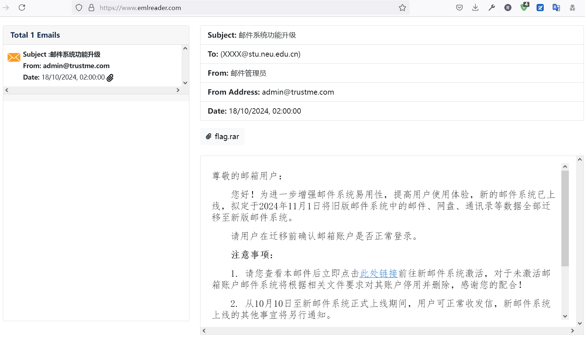
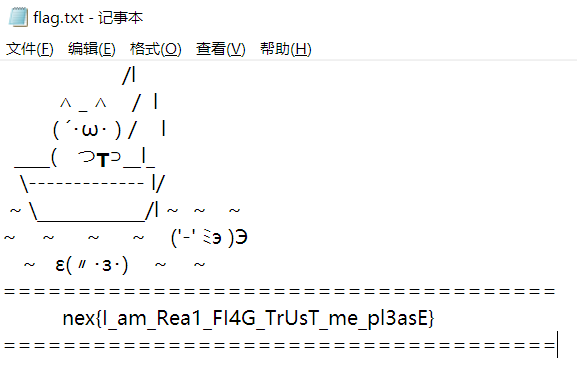
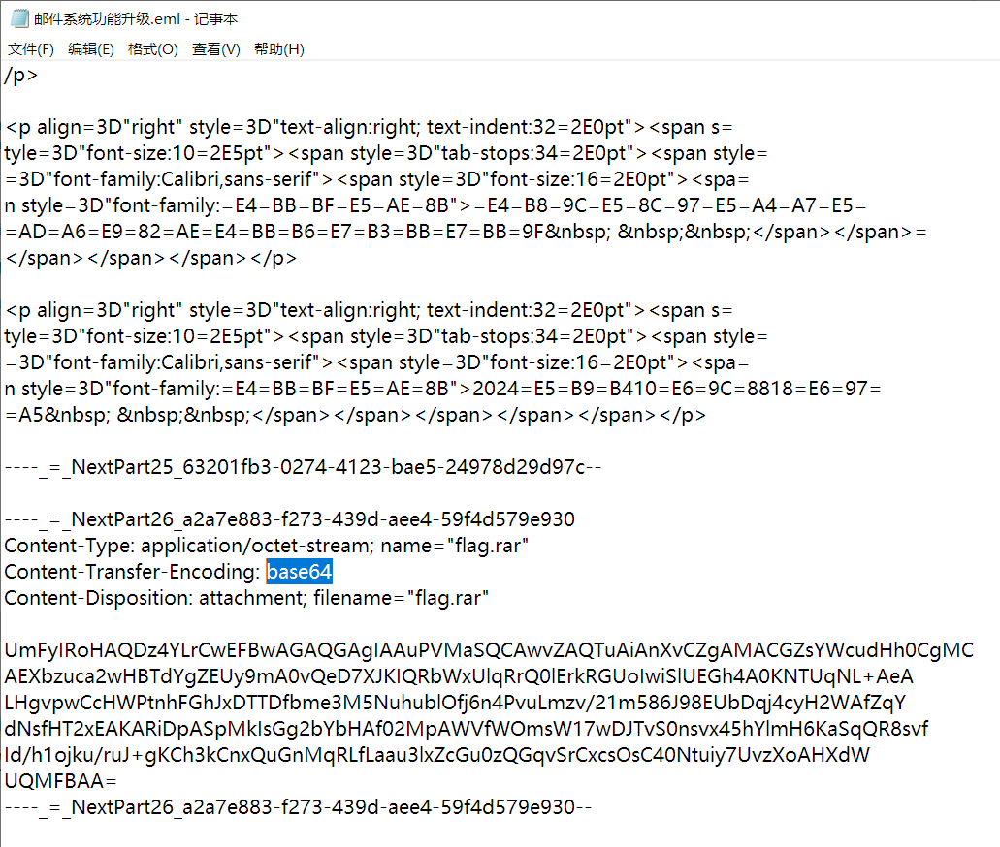

# (1/2) 邮件系统功能升级

## 【简单】admin@trustme\.com

出题组为了给大家整点简单题，可谓是费劲了心思。本来还想结合 SPF、DKIM、DMARC 的知识，但这样不就变成理论题了；让选手们自己搭建一个 SMTP 服务器，又不太好考察，遂放弃之。所以本系列的难度曲线不太平滑。

大家的学生邮箱里肯定出现过“**邮件系统功能升级**”，这是信网办为了完成指标发的。本题的来源，就是我把这封邮件 Download as EML 然后加了个附件，非常地**贴合实际场景**！

本地有安装 Outlook 的话，直接点开就完事了。有的选手还使用 QQ 邮箱等功能在线预览 EML。我这里随便找了个网站，也是非常顺利地就打开了。

解压 flag.rar ，里面就有 flag 。简直不要太简单！

当然，大家更是可以去了解一下邮件（EML）的传输格式。**SMTP 协议**本来是不支持传送非 ASCII 字符的！于是，便采用了 UTF-7、quoted-printable、base64 这样的编码方式。你很可能难想象，现代的邮件系统竟然还在使用这么古老的明文协议（就跟 HTTP/1.1 一样）！

所以，要提取附件，只需要把这部分内容拿出来，**base64 解码**就完事了。Python 也就一行的事儿。

