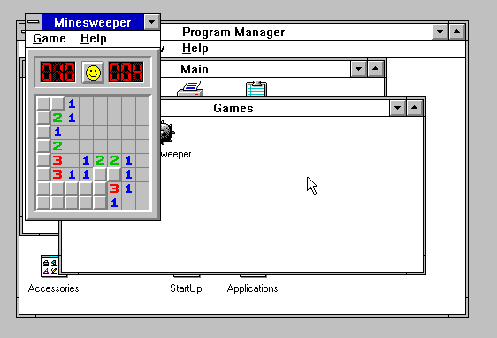

# 【简单】时光机器 (Time Machine)

出题组为了给大家整点简单又好玩的题，可谓是费劲了心思。本来是想整一个 COM 程序，只能在 MS-DOS 实模式下运行，后来又一想，不对这不成逆向了吗，拖进 IDA 里秒出，遂放弃之，于是便有了本题——在浏览器里运行 Win 3.1 。

本题源代码基于 https://github.com/copy/v86 修改。


打开网页，按照题目给的描述键入 ```win /s``` 便能**以 Standard 模式启动 Windows 3.1** 。不带这个 /s 参数的话，是以 386 兼容模式启动，但是有 bug，开不起来。


经典的”视窗“图标，大家都见过吗？


进来之后呢，首先你当然可以打开**扫雷**打上一把 :)




按照题目描述，只要用画图打开 **C:\FLAG.BWQ** 就可以了。实际上不用修改后缀名，我们首先打开 **Paintbrush**，左上角 **File -> Open**，然后就出来一个至今还存在于 Win11 里的上古 COM **文件选择框**，左下角文件类型点成 **All files**，右边选到 **C:\ 根目录**，**双击 FLAG.BWQ** 。


使用的是 PIL 默认的字体，手敲时要特别注意区分 ```1lIi``` ，```o0O``` 其实还算比较明显。


大家基本上都能跟着操作，体验了一下史前操作系统的使用。Windows 3.1 的操作设计跟 Classic Mac OS 类似，反倒是后来没了的 OS/2 把关闭按钮设在了右上角。同时 Win 3.1 还**没有右键**功能，并且采用的网络栈协议不是 TCP/IP ！虽然能够通过 WinSock 扩展的安装，使其获得 IP 地址，还能与开启 SMBv1 的 Windows 11 操作系统进行文件共享 :) ，但我们这里的运行环境是在 “浏览器” 里，这也为下一题埋下了伏笔。