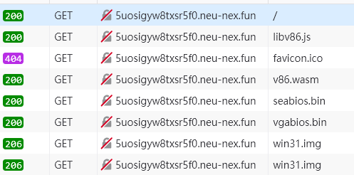
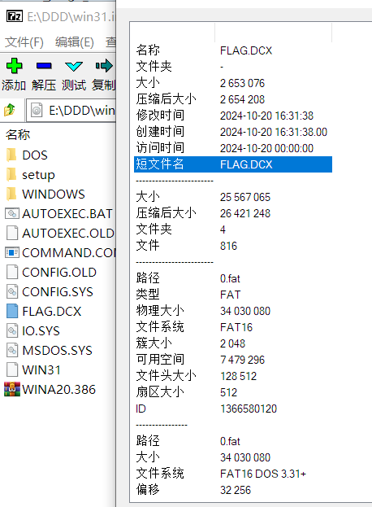
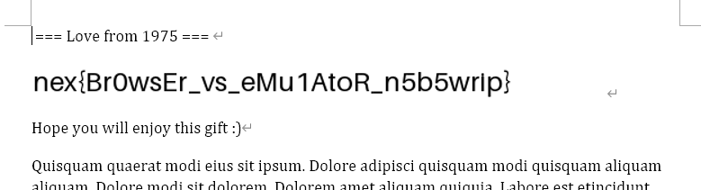

# 【中等】时间悖论 (Time Paradox)

出题组为了给大家整点简单又好玩的题，可谓是费劲了心思。话接上文，这个环境只出一道简单题那也太浪费了。于是借由 Time Paradox 的典故，将使用**现代程序**才能打开的文件（DOCX）整了进去。

那该怎么办呢？依据 John Titor 的理论，大家在 Win 3.1 里是绝对无法打开这个文件的，否则，就会形成**时间悖论**。

这时候便需要利用到你的 “Reading Steiner” 之能力。也就是说，只有你，有办法 "Think outside the box"，感知到世界线的变动，以 “第三者” 的视角看待所有的世界线。

不说得那么神神叨叨，实际上很简单，你现在在 2024 年，又不是 1992 年，一个小小的 DOCX 还怕打不开不成？所以问题的关键点是，怎么把这个 DOCX 文件**弄出来**呢？

我注意到有选手尝试使用 “网络” 这一功能，因为我打的 Network 标签。但是很遗憾，这个 x86 wasm emulator 跑在**浏览器**里，Win 3.1 默认也**不支持 TCP/IP**，而我的代码肯定是没给它提供模拟联网的设备的。

右键查看源代码，或者 F12 看网络流量，实际上能发现，为了实现 Win 3.1，浏览器请求了一个 libv86.js，提供前端的执行框架，v86.wasm，提供核心的 CPU 模拟器，seabios.bin，大家应该很熟，就是 QEMU 采用的那个 x86 BIOS，vgabios.bin，字面上意思，就是显卡，最后的 **win31.img**，应该就能猜到，是**包含 Win 3.1 的启动盘文件**了。

这么捋一遍，把浏览器是怎么运行 Win 3.1 的问题解决了，其实跟 QEMU 是一个原理，只不过 C 换成了 js 跟 wasm 而已。不知你是否已经恍然大悟，只要把 win31.img 下下来**解包**，里面不就有 FLAG.DCX 了么？

这就是我为大家提供 Hint：“*1992 年，Win 3.1 的硬盘格式为 FAT16。1997 年，第一版 DiskGenius 的前身发布；其直到 2024 年还在更新。*” 的原因，就是怕各位不知道咋打开这个 **img raw 磁盘镜像**。

这个 img 镜像它包含一个 BOOT SECTOR，所以你可能没有办法通过虚拟光驱等工具直接映射。很显然 **DiskGenius** 是可以的。只不过我后来才发现 **7zip** 也可以直接打开，那就更简单了。

这时候你就成功地从 1992 年回到了 2024 年，然后用你的 Word/WPS 直接打开就完事了。

我感觉挺简单的，但是解出人数不知道为啥这么少  (⸝⸝⸝• ω •⸝⸝⸝) 