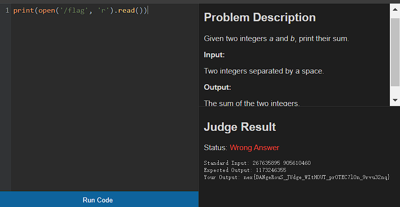

# (1/3)  Online Judge

## 【简单】Uncontrollable

我一想，前面让大家玩得开心了这么久，是时候回归一下老本行，毕竟生活中不会只有顺心事。本系列是一个非常**经典的 CTF Web 系列**。前两道题给大家热热身，第三道题已经可以算是能出现在 CTF 比赛中的题了。虽然由于我的设计失误导致唯一解是非预期，但其实也算变向为大家降低了难度，出题人真善良。

本系列其实是参考 oj.neu.edu.cn 设计的，当然我千万没有那个意思，只是从网络安全的角度上带大家合计合计而已。

流行的 OJ 一般会采用底层沙箱，如 **seccomp**，但这里为了给大家降低难度，使用了最时髦的 Python 语言进行设计。

本题呢，其实没有任何难度。**没有任何限制**，调用 **exec()** 直接执行代码。当然某些行为可能与各位直接在控制中尝试的不太一样，但其实完全不影响。特别是善良的出题人还提示大家，Flag 位于评测机的**根目录**下。不知道为啥有的同学会对这句话的理解产生歧义，我自认为说得很清楚了，根目录就是 Root directory，而且是评测机的根目录不是 Judger 的根目录（这个应该被称作当前目录）也不是网站的根目录。

由于有回显，代码也很简单，一行就完事了。

大家只要会 Python 应该不难写出来吧？