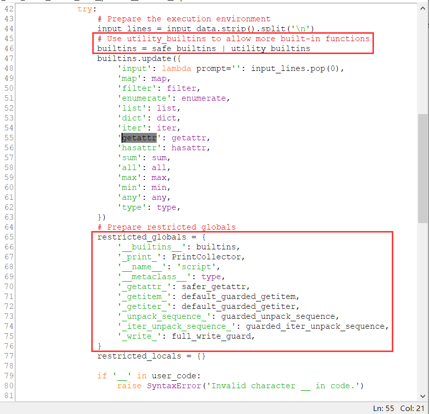

# (3/3)  Online Judge

## 【困难】Escapable

断网之后，再修了侧信道泄露的问题，还加了沙箱，这些因素综合起来，使其成为了一个经典的 CTF Web 题。难度是足够的，本来想作为防 AK 题的，没想到出了**非预期 :)** 。

老油条可以一眼想到，**断网 => 打内存马**，**沙箱 => 开绕**！当然善良的出题人考虑到大家的经验不足，也添加了足够的提示。

感兴趣的同学可以自行学习，这里就不细说一些关于 **Python 继承链**以及 **attribute** 的基础知识了。

首先 **RestrictedPython** 是最新版本，没有 0day 可以绕过。当然也没有选手当场挖出来 (˶˃ ᵕ ˂˶)

看看源代码，首先 builtins 被换了。[builtins](https://docs.python.org/3/library/functions.html) 是 Python 的内置函数、对象或类型集，当然也包括 eval()、exec() 或 compile() 这些危险的函数。使用 RestrictedPython 提供的 safe_builtins 基本上就杜绝了对这些危险函数的直接访问，因此保证当前执行环境是安全的。



如果大家稍微了解过 CTF Web 的话，应该对 **SSTI（Server Side Template Injection）** 这个词有点印象。SSTI 在 Python（准确的来说是 Flask 的 **Jinja2** 渲染引擎）里的攻击方法体现，就是**绕过沙箱**。其利用 Python 对象的继承链一步步往上溯源，如 ```__mro__, __subclasses__, __class__, __init__, __globals__, __builtins__```，最终可以访问到当前**执行环境作用域外**的**全局变量**，然后通过它们找到 exec() 或调用别的危险函数。

以上这些，大家可以通过搜索 "**Flask/Jinja2 SSTI**" 关键词学习。

那么在本题，很显然无法直接采用类似的 Payload 。因为 Python 的 "." 运算，最终调用的是 ```__getattribute__``` 这个 Magic method，而 RestrictedPython 通过手动解析 AST 将类似的调用都进行了检测，体现在 Line 70 的 **safer_getattr** 处。该函数会**拒绝获取**任何 Python 的危险内置属性，包括 co_code，或任何**以下划线开头**的属性名。并且，本题中（Line 79）也对代码进行了一个简单的过滤，不能直接包含两个下划线，因此类似于 ```obj.__class__``` 是行不通的。

那么问题出在哪里呢？善良的出题人也给予了也大家提示，就是 **getattr()** 。本题为了支持调用 map() 等看上去人畜无害的 builtin-functions，特地引入了诸多内置函数，却不知其中最危险的就是 getattr() 。上面说过，"." 调用的是 ```__getattribute__``` ，那么最终来到的肯定是 **getattr()** 这个内置函数。题目环境直接将它引入 builtins 里了，就相当于 safer_getattr 啥用没有，把 ```obj.__class__``` 写成 ```getattr(obj, '_'+'_class_'+'_')``` 即可。

然后就可以沿用 SSTI 的方法成功找到 **app** (Flask Application) 等变量，并且重新引入 **import、exec()** 等关键函数 。

这是本题的第一步，唯一解的那位同学也是按照预期想到了这里。

然后事情就开始变得不受控制了 :)

问题的根本原因出在哪里呢，其实都得怪 WSL（还是不嫩怪我！）。大家应该能发现，WSL 在 /mnt/ 目录下，即访问 Windows 文件夹时，默认配置下，**所有文件的权限都是 777** 。我把这一点给忘了，我还当 644 呢，在 Dockerfile COPY 进去的时候所有者会变成 root，也就是说在创建容器环境时，若把 python 用 app 普通用户权限运行起来，**应用程序当前目录理应是不可写的**。当然这是建立在文件权限为 644 的前提下，实际上在题目环境里它们是 777 ，也就是说随便写。

这一点着实为本挑战降低了不少难度。这样的话就用不着 Flask 内存马了。

要拿到执行的结果，有几种非常典型的方法：【简单】难度直接回显，【中等】难度通过网络外带，另外呢就是侧信道泄露（执行时间、HTTP Status Code 等信息），还有一种类型就是修改当前应用程序。

PHP 直接改就完事了，每次执行都会重新读取。但像 Python、Node.js 这种语言，程序的代码在刚开始执行的时候就已经读取完毕了，并且此后都不会再进行二次读取（当然，除了外部引用）。包括本题中使用 Production 模式运行的 Flask 应用程序，甚至对于 templates/ 里的模板文件都会在第一次访问时缓存，之后再怎么修改都**不会重新读取**。

非预期解的那位同学，实际上还利用了题目环境的另一个机制——用 **gunicorn** 起的**四线程**服务器。很合理的是，当一个 worker thread 掉了的时候，daemon 就会重新把它拉起，在这个过程中，就会重新读取一次代码。当然，这跟环境的 restart: always 没什么关系，因为按照我的设计，init 进程挂了之后是没办法再开起来的，只能重开容器。

所以他的做法是：sandbox 逃逸完后，直接获取 flag 并**写在 app.py 或 templates/index.html** 里，然后 os.kill() 掉当前 worker thread，之后再刷新，等再次负载均衡到这个 thread 时，就能回显出写进去的 flag 。

777 权限无疑为本题降低了不少难度。但如果是按照预期的 644 设计呢？应用程序目录不可写。

其实也不难，大家直接搜关键词 “**Flask 内存马**” 就行了，简单来说，就是获取到 app 变量后，再为它重新注册一个恶意的路由。一些过时的文章提到的 add_url_rule() 在高版本 Flask 下是不行的，我这里采用了 **before_request_funcs** ，相当于拦截路由然后包含 flag 的回显即可。

经过了如此漫长的分析，最终得到的 exp 其实很短：

```python
g = getattr(input, '_''_globals_''_')
imp = g['_''_builtins_''_']['_''_import_''_']
g['app'].before_request_funcs.setdefault(None, []).append(lambda imp=imp: imp('subprocess').check_output(['/readflag']))
```

运行过后多刷新几次即可。

644 的情况，本题其实还存在另外一个**非预期解**，我也在撰写本 wp 时才猛然发现。大家是否注意到了呢？

