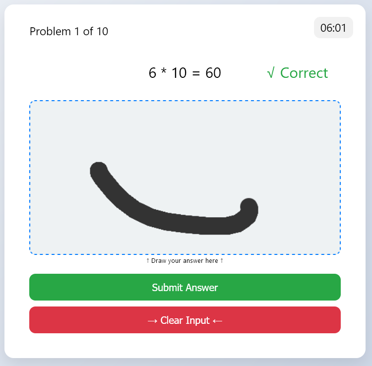
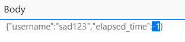

# 【中等】一觉醒来全世界计

出题组为了给大家整点简单又好玩的题，可谓是费劲了心思，不惜蹭了一波小猿口算PK的热点。本题其实是作为 **“游戏” 系列**的第二题，只不过放在了前面，另一个是 “小恐龙”，在后面会谈到。本题的构想就是引导玩家通过手动修改 **HTTP POST API** 的参数，来达到作弊的效果。曾经也考虑过鼠标连点速度测试、微信跳一跳、甚至一些更为复杂的网页游戏，最终还是由于日程安排上的紧张，只是简单地整了一个四则运算。


对于这个 MNIST 数字识别的部分，其实真的不怪我。**善良的出题人**已经很努力地在提高识别准确率了，最开始本题的 beta v1.0 测试版时，对于某些数字的识别成功率只有不到 1%；由于神经网络模型是从网上偷来的，也不知道它的结构是不是按照 MNIST 标准，反正经过一波玄学的调大小+比例之后，成为了目前各位能看到的情况。



你就说**准**不准吧。


但万一实在识别不出来的话，也不会影响本题的解答。对着灰色的 Submit Answer 右键点击审查元素，你能看到这个 button 的 HTML tag 。实际上把 **disabled 属性一删**，这按钮就可以点了，点完就进入到下一题了。


还有更简单的，如果你尝试阅读过本题的源代码的话，你会发现有一个叫 ```completeChallenge()``` 的 JS 函数。你把它贴到控制台里边，一个回车，诶，就**直接跳到**排行榜的界面了，还能刷个 0 秒出来。


不过这些在真正的实力 AAA挂哥 面前都是雕虫小技。你会发现，不管你取啥名都只能排在 AAA挂哥 后边，因为后端代码 Python sorted() 是保序的，AAA挂哥 先来的，他始终**顶你前面**。


这才是本题真正的考点，我们观察一下在进入排行榜时产生了哪些 **HTTP 请求**，首先是这个 **/api/submit** 。


可以发现，它的作用很明显是将你的当前成绩记录到后端的排行榜里。


要超过 AAA挂哥，你就必须成为神。所以你对准这个请求右键 **Edit and Resend**，然后把 **elapsed_time 改成了 -1** 。




再次进入排行榜，你的 flag 已经**赫然超过** AAA挂哥。此刻你已成神。作为一名小学生。


或者，你也可以使用 Charles、Burpsuite、右键 Copy as Fetch、甚至 curl 等方法来往 /api/submit 发包。


本题并没有（或者本意没有）给大家设置任何的障碍，依稀记得，以前玩过的坑爹小游戏里就有那种手写数字的关卡，怎么写都写不对，我怕给各位气着急了，尽自己最大的努力调高了识别率，如果你因为写的数字太漂亮被它识别不出来，还求求你不要骂我。