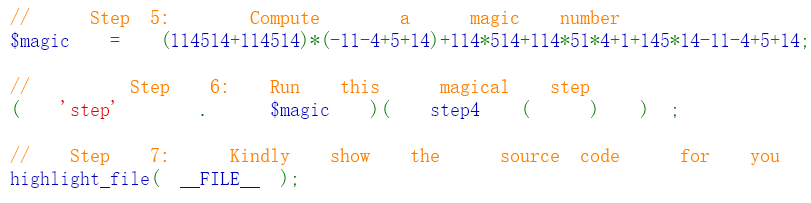
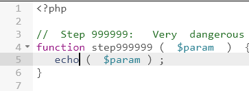
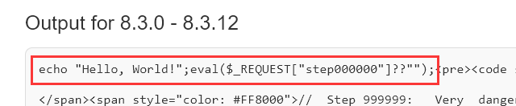
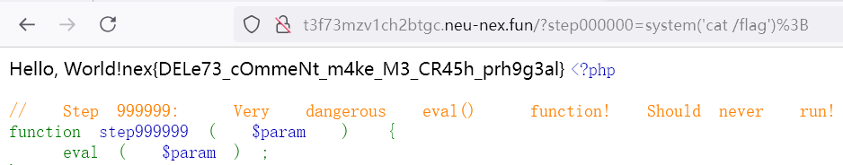

# 【中等】Don't Touch My Code!

在整了这么多道题之后，突然意识到，诶不对啊，咋没有 **PHP** ？说到 CTF Web，避不开的话题就是 PHP，于是当即决定新增一道。不过到底考啥，倒是个难题。总不能给大家整些 PHP 小技巧吧，这也太无聊了。类型混淆，反序列化，内置类，都考出套路来了，放在这里显然不合适。于是想起之前在 X 乎上刷到的一篇文章，利用**空格**等元信息**隐写 webshell** 。

首先，本题的代码逻辑真的很简单，我连注释都没删。

最开始映入大家眼帘的就是一个大大的 Hello, World! 。这时候应该能想到，诶不对啊，如果 Hello, World! 本来就在代码里，那最后 highlight_file() 又显示了一遍，不应该**出现两次**才对嘛？所以这个文件肯定有**蹊跷**，底下有你**看不到的代码**正在暗流涌动......

PHP 作为一门弱类型语言，甚至直接支持了**动态调用函数**，即，函数名是字符串而不是语法成分，它也能调用。



所以上面的代码直接调用到了 step999999，也就是危险的 **eval() 函数**。**step4()** 执行的结果则作为参数，所以这里的目标很明确，就是要搞明白它到底执行了什么？

前边的逻辑也很简单，甚至有注释，AI 基本上不可能给出错的解释。

**获取所有连续的空格字符，并根据它们个数的奇偶性转换成二进制字符串，然后再转成 ASCII 码。**

所以说，如果你擅自改动代码里的空格，破坏了它的平衡，解出来就会是乱码。当然，在解码前需要记得把前边的 Hello, World! 删了，因为它原本就不是代码的一部分。

选手们的 wp 里大致有一半左右，采用了 Python 进行解码，这是完全没问题的。

实际上有一种非常简单的解法，不是说不能变空格个数么，那不动空格不就行了？



我们把这个 eval() 一改，诶改成 echo，然后再运行。（ https://3v4l.org/JIUlk）



会发现这就把原来执行的代码打印出来了，里面确实有**隐藏的 echo "Hello, World!"** ，并且还有一个经典的 PHP **webshell** ！

稍微了解过一点 CTF Web 的选手们到这应该已经很轻车熟路了，再加上善良的出题人并没有让大家再绕过 disable_functions 什么的，直接传参 ```step000000=system('cat /flag');``` 即可。



在与选手交流的过程中，我才意识到大家可能会掉进的坑点：

1. IDE 自动把行末的空格删了！这个我只能说，哈哈，没办法，小心再小心吧。事实上，你从网页上直接 Ctrl+A 复制下来，然后粘贴到记事本里，一点问题都没有。
2. 传参咋没反应呢？因为前端的 Nginx（或者可能是 frps）比较严格遵守 RFC3986: Uniform Resource Identifier (URI): Generic Syntax 标准，将你的分号 ; 当做了 sub-delimiter ，所以传到 PHP 以后整个参数就消失了！！将 ; 进行 URL 编码变成 %3B 后再发送，或者直接采用 POST 方法，即可避免这个坑点。

PHP 作为一门神奇的语言，也是仅有的少数的设计稀烂的并且还在被广泛应用的语言。当然自从 PHP 8 以后，安全性增强了不少，比如去除了 phar 反序列化特性，优化了强类型标注功能，内存漏洞只能说还未被发现吧，但 PHP 仍然还是 CTF Web 题里的常客，BlackHat 的常驻嘉宾，没几年就会爆出新的利用技巧。所以说，PHP 题是最吃底子和经验的。

说回本题，eval() 底下调用的是 zend_exec() 函数，实际上等效于直接将字符串替换在代码文件里，这与 Python 的 exec() 的实现非常不同。

事实上，本题还可以通过 https://github.com/extremecoders-re/php-eval-hook 直接秒，当然这有点儿小题大做了。以后如果遇到特别恶心变态的 PHP 加密，不要忘记我和它就行。