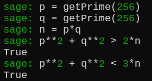
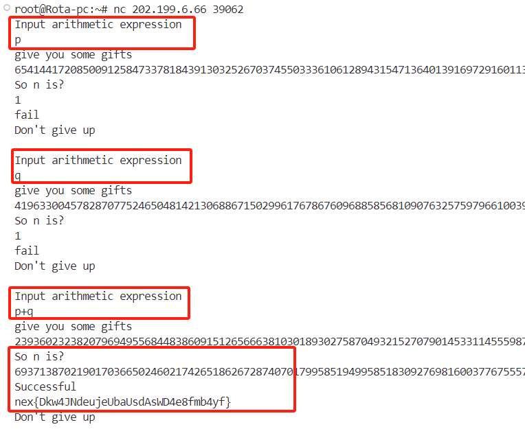
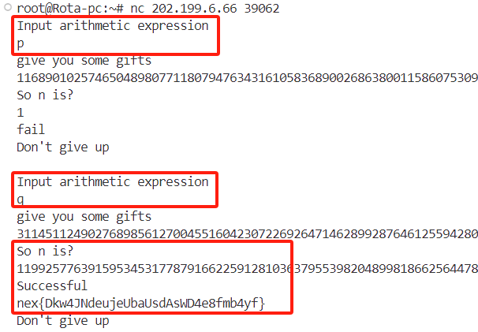

# guess_number1
这题其实根本不用什么数论就能解，你只需知道模运算就好了。  
另外可能看起来很难，实际上你如果仔细看下来，你会发现是很简单的，当你不知道为什么的时候，拿笔算算或者本地生成数据看看。
## 解法一  
### 证明
假设现在的情况是<div align="center">
$ p > q $</div>
那么有<div align="center">
$p^{2} < n$  及 $ q^{2} > n$</div>  
当分别输入 $p$ 和 $q$ 时得到的实际上是<div align="center">
$p^{2} \quad (1)  $  
$q^{2} - n \quad (2) $</div>
对于上面这两个数而言，只要把 $p^{2}$ 和 $q^{2}$ 消掉就能得到 n  , 那 $p^{2}$ 和 $q^{2}$ 怎么来呢？  
我们发现在模 $n$ 下存在这样的性质，即输入$p+q$后真正得到的:<div align="center"> 
$(p+q)^2\\
= p^2 + 2*p*q + q^2\\ = p ^ 2 + q ^ 2 \ (mod \ n )$  </div>  
将其转换到实数域上得到：<div align="center">
$p^2 + q^2 - 2*n\quad (3)$</div>
> 同样对于 $(p-q)^2$ 结果是一样的  

> 那这为什么是$2*n$呢，最简单的方法就是拿数据测


现在答案已经很明显了，将$(1)$和$(2)$相加再减去$(3)$即可得到$n$。  
再给大家推一下:<div align="center">
$ \quad (p^{2}) + (q^2 - n ) - (p^2 + q^2 - 2*n)\\
= p^2 + q^2 - n - p^2 - q^2 + 2*n\\
= n$</div>
> 这种方法其实跟 $p,q$ 大小无关，反正把 $p,q$ 输进去的加起来, 然后减去输入 $ p+q $ 的值就是 $n$  

### 说人话
输入$p,q$，然后将结果相加,再减去输入$p+q$得到的结果就是$n$  

交互： 

## 解法二  
### 证明
解法二相比一来说需要开方和解方程，我更推荐解法一。  
对于$(1)$而言由于可以直接开方得到p，我使用的是gmpy2的isqrt函数: 
``` pyhton
from gmpy2 import *
p_2 = 
p = isqrt(p_2)
assert p**2 = p_2
```
> isqrt有个缺陷就是它不会管你是不是完全平方数，如果不是会直接开出离数据最近的数

由于求出$p$了然后对于$(2)$而言，假设输入$q$后返回的是c有:<div align="center"> 
$q^2 - p*q = c$</div>  
大家其实可以发现这就是个一元二次方程，直接解方程就完事了，当然如果你用的是传统的解方程方法也是行的，我用的是**sagemth**：
```python
var('q')
solve([q^2 - p*q == c],q)
```
然后解出来 $p$ 和 $q$ 后, <div align="center">
$ n = p * q $</div>

### 说人话  
对$p$或$q$开个方，然后解个小学生可能会的一元二次方程，再把两数乘起来

---
交互:  

