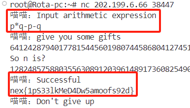

# guess_number2 
## 证明
这题你做出来可能需要了解一下欧拉定理，即

$ 2^{\varphi(n)} = 1 \ (mod \ n) \quad (1)$

> $\varphi(n)$ 为 $n$ 的欧拉函数

对于本题而言 $n$ 欧拉函数为

$(p-1)*(q-1)$ 
  
那么对于$ (1) $而言:

$2^{(p-1)*(q-1)} = 1 \ (mod \ n)$  
$2^{p*q - p - q + 1} = 1 \ (mod \ n)$  
$2 * 2^{p*q - p - q} = 1 \ (mod \ n)$

再将其转换到实数域上得到:

$2* C = 1 + n$
  
> 其中$C = 2^{p*q - p - q} \ (mod \ n)$

## 说人话  
往终端里输入 $p*q - p -q$得到$C$，然后:

$n = (2*C - 1)$

交互：  
  

---
这题解出人太少是我的责任，没有在题干里提一提欧拉定理。

