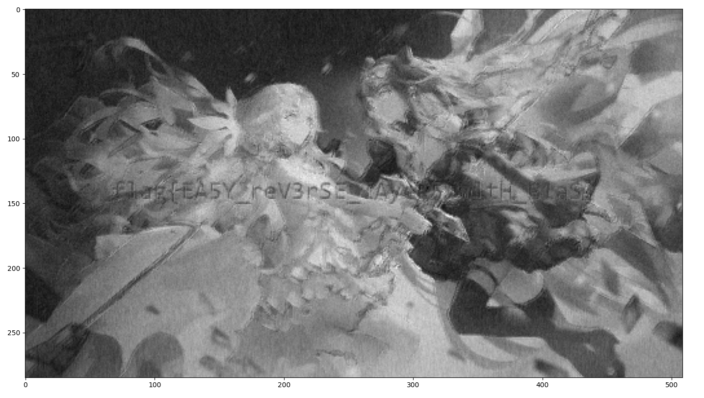

## 【 ? 】网络迷途

其实是某比赛的原题，被我搬过来了，这个 wp 也是（

目标是从给出的 output 反推输入。

观察网络结构，前三层为 Conv2d、Conv2d、MaxPool2d。由于 kernel 很小，图像经过三层处理，应
该仍然能肉眼看出 flag。

因此考虑如何恢复出 Linear 层之前的图片。显然，要完全恢复 10 个 channel 是不可行的，因为在
Linear 层之后，经历了 1x1 卷积，将 10 个 channel 合并成了一个 channel。

注意到 1x1 卷积可以认为是各 channel 的加权平均。所以，我们不再尝试恢复出 10 个 channel，而是
去恢复这 10 个 channel 的「均值」。

因此，解题过程为：

1. 通过 sigmoid 的反函数，恢复 1x1 卷积层之后的图像
2. 减去 1x1 卷积的 bias、除以 1x1 卷积的 weight 均值，获得 Linear 层之后的「均值输出」
3. 减去 Linear 层的 bias、乘以 Linear 层的 weight 矩阵之伪逆矩阵，获得「均值图像」
4. 从图像中观察出 flag，其实后来发现后面有几个字看不清，不过貌似没人到这一步，就算了。

```python
import torch
import torch.nn as nn
import torchvision.transforms as transforms
import torchvision
from PIL import Image
import matplotlib.pyplot as plt
import numpy as np

net = torch.load('net.pt')

y = np.array(Image.open('enc.png').convert('L')) / 255

y = torch.Tensor(y).reshape([1, 285, 2850])

y = -torch.log((1 / y) - 1)

w = net[-3].weight.detach()
x = (((y - net[-2].bias.detach()) / net[-2].weight.detach().sum()
    -net[-3].bias.detach()) @ w.T.pinverse())

plt.imshow(x[0, :, :], cmap='gray')
plt.show()
```

