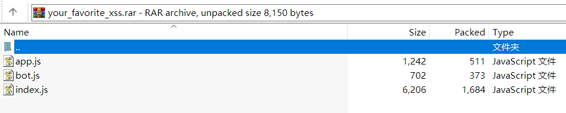
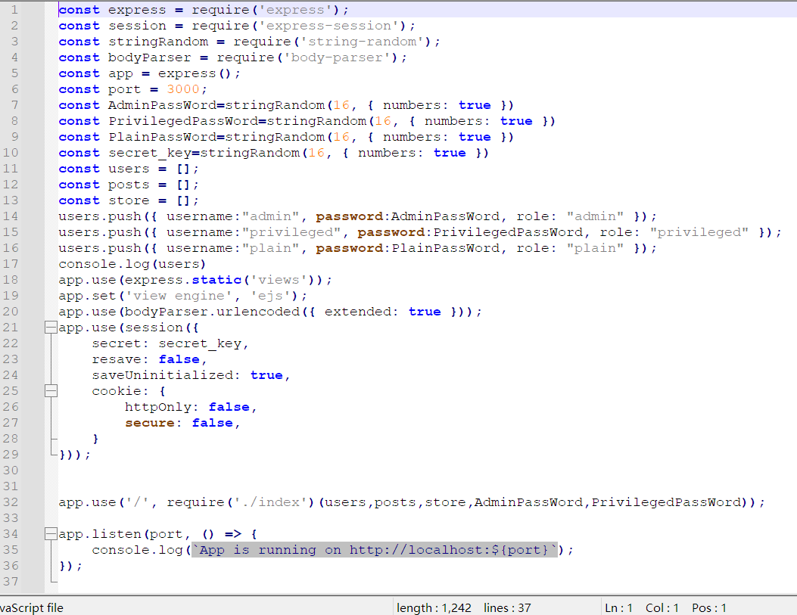
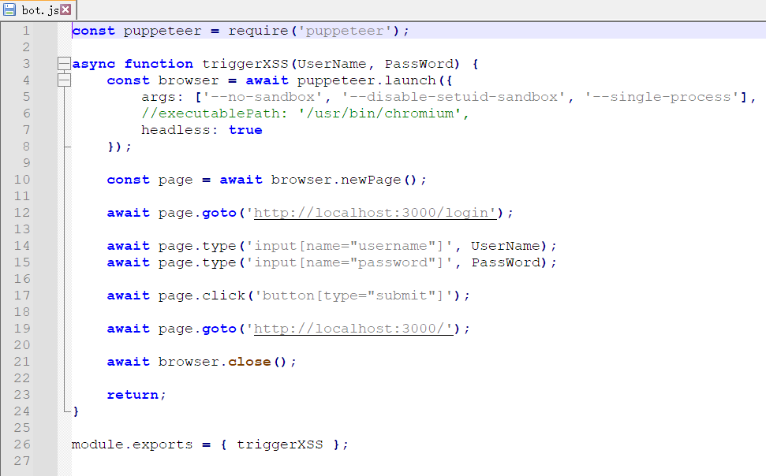
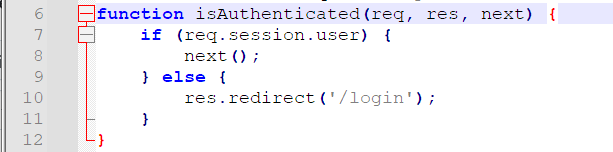
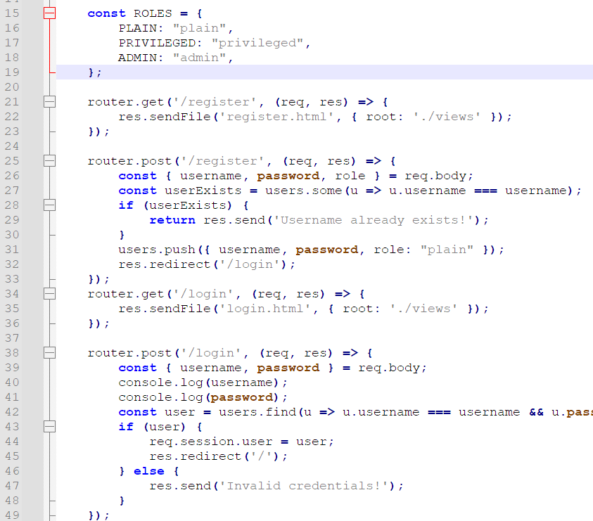
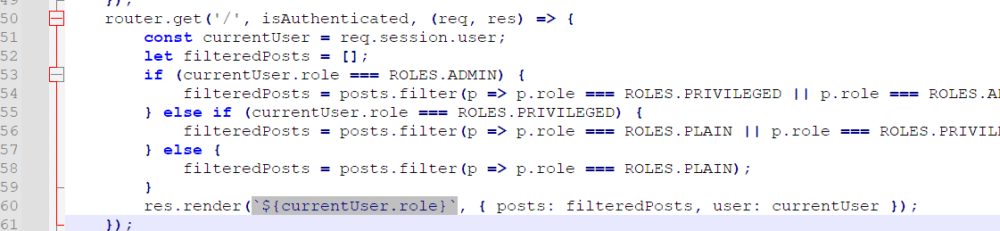
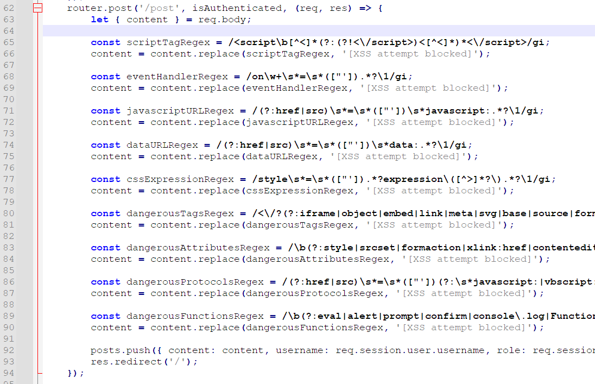
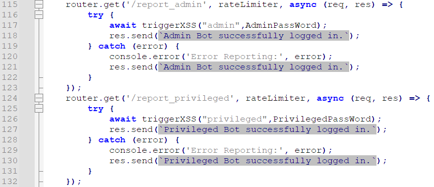
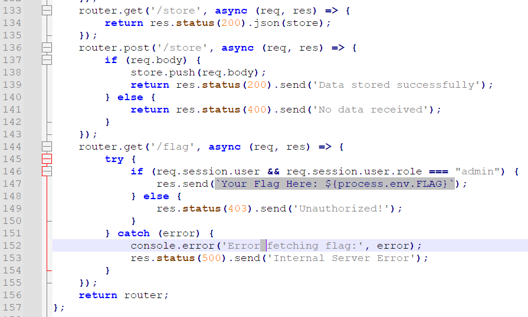

# 【困难】Your Favorite XSS

应参赛选手对于 XSS 的热情，现场特意加的新题，属于十分传统的 CTF Web 题。对于这种类型的题，除了对应的漏洞点，还有一个必须要掌握的技能就是“**代码审计**”，特别是在中大型项目里。

代码审计的概论，实际上就是你得到 flag 的过程，也被称作**攻击路径**（Attack Vector）。你需要时刻牢记你的最终目标，以及在当前阶段能做到什么，并在审计的过程中不断更新这样的信息。

接下来，我将带领大家体验一个完整的代码审计过程。

拿到这么一个压缩包后，我们要清楚它的结构是什么。



很明显这个压缩包是不完整的，其没有包括 Dockerfile 或 packages.json 。这也暗示着本题的预期解与运行环境或某些组件的低版本漏洞没有关系。

对于一个 Web 应用程序，你的入口点是浏览器，在代码中体现为路由。当然，你也可以按照一般的程序执行入口点，从 app.js 开始看起：



说实话这里边并没有什么有用的东西，但至少我们现在知道其采用的是 express 框架，ejs 模板，Admin/Privileged/Plain 密码和 secret_key 都是真随机生成，bodyParser 只有 urlencoded，而这些信息对于掌握全局至关重要。

然后再看 bot.js 。（按我个人的习惯，先看小的 :）



是一个非常明显的 XSS 漏洞触发点，其调用 Headless Chrome 进行了如下操作：访问 /login 界面，以给定的用户名密码登录，然后再访问主页。这意味着我们可能需要在主页 / 上插入恶意脚本，以此来窃取它的会话信息。

接下来的重头戏肯定是路由，路由直接代表了我们可以做什么。

从前往后慢慢看。首先，这里有一个 isAuthenticated 的中间件，这意味着有些界面可能需要登录后才能访问，而我们窃取的会话信息，很可能就是为了绕过这个验证。



再看，这是一个非常典型的 登录与注册 的路由写法，并不存在很显然的漏洞。其还分了三种权限，结合之前已有的信息，即，我们有极大的可能需要通过 XSS 泄露 admin 用户的会话信息，并以此获取 flag 。



接着看，主页面 / 从 posts 根据权限进行了筛选。由于我们刚开始注册的是 plain 用户，而 admin 根本看不到我们发的 post，所以很可能还需要通过 privileged 用户作为跳板。



接下来，就是发 post 的关键路由。可以发现其经过了，额，只能说很多的过滤。咱们现在先掌握全貌，这其中的细节可以先不用去深究。其实能猜到，作为一个 CTF 题，这地方肯定是能绕过的。



之后这里是经典的 XSS 触发点。其分了两个等级用户登录，也印证了之前的猜想，需要从 plain 先到 privileged，再从 privileged 到 admin 。



最后，这里的 store 路由，其实也算暗示了题目不出网了。要是能访问外部网络，还要这 store 干啥？于是我们又记着了，还有一个临时信息中转站的功能。



作为结束，/flag 路由验证了必须是 admin 进行访问。看到这里，我们已经获取了很多信息，再进行一下逻辑链的推演，已经可以还原出本题的攻击路径：

1. 注册 plain 用户，发表 post XSS，让 privileged bot 触发，可能将结果存在 store 里。
2. 以 privileged 用户的身份发表 post XSS，让 admin bot 触发，将 flag 存在 store 里。
3. 获取 flag 。

当然这其中还有一些细节，我们没有推敲。比如，如何以 privileged 用户的身份发表 post XSS ？当然，可以使用 JS 代码 fetch() 完成这一请求，但由于本题没有给 cookie 设 HttpOnly，最快的办法是直接把 privileged 用户登录的 session cookie 拿到手。又比如，如何把 cookie 存在 store 里呢？当然，这里其实涉及到一个坑点，之后会细讲。最重要的是，XSS 如何实现？由于本题也没有 CSP 等保护，再加上没给 / 页面的 ejs 源码，所以只能试一试如何绕过那个过滤了。

熟悉 XSS 的朋友们，或者可以直接从网上搜到，那一长串的检测至少存在两种绕过方式：

1. ```<script>11111;</script >```
2. ``````

前者由于 ```</script>``` 匹配得太严格了，在后面加个空格照样执行；后者由于 onXXXX 匹配得太严格了，没有引号照样执行。

能任意执行 JS 代码之后，剩下的就只有完成先前推导的攻击链了。

偷取 cookie 并存在 /store 的关键代码如下：

```javascript
<script>fetch("/store", {
  method: "POST",
  body: JSON.stringify(document.cookie),
  headers: {'Content-Type': 'application/x-www-form-urlencoded'}
});</script >
```

这里需要注意，由于 puppeteer 的特性（ https://stackoverflow.com/questions/52129649/puppeteer-cors-mistake ），没有 Access-Control-Allow-Origin 头的网站，当然就包括本题环境，只能以 no-cors 的模式请求。

很显然，no-cors 模式无法获取 fetch() 返回的 Response 文本（也被称作 opaque），否则 CORS 就没有意义了。当然，也不能 POST  application/json 类型的数据，这是由 RESTful API 的设计决定的。在满足这些详细的规则（ https://developer.mozilla.org/en-US/docs/Glossary/CORS-safelisted_request_header ）后，其实浏览器会自动以 no-cors 的模式去 fetch 。

这样的特性也决定了，我们没有办法指引 admin bot 去访问 /flag 路由，而只能偷取它的 cookie，我们自己登录后再去 get flag 。

所以说，经过一系列的分析，本题的操作实际上也不难：

1. 注册新用户；
2. 发表如上 XSS 内容的 post；
3. 在 /store 处找到 privileged 用户的 cookie，并覆盖为它的；
4. 再次发表如上内容的 post；
5. 在 /store 处找到 admin 用户的 cookie，再次覆盖；
6. 访问 /flag 。

大家以后在比较正式的比赛中遇到的 CTF 题，基本上都是这样式的，不仅考察基本的漏洞点利用，还会加上一些小技巧让你绕过，最后需要结合题目中的各种线索，拼凑出完整的利用链来。

