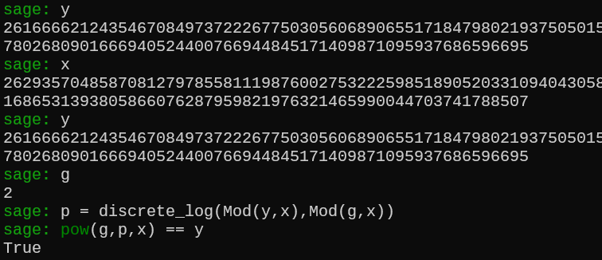

# guess_number3.5
这题无解出确实是我的锅，因为最后一天才端上来，我也是当时突然想到guess_number3条件还能再严苛点的。  
**前方高能预警**  
## 证明

离散对数问题指的是对于<div align="center">
$a^{x} = b \ (mod \ p)$</div>
已知$a,b,p求x$，把本题的数据带进去就是：<div align="center">
$2^{p} =  c \ (mod \ x)$</div>
由于$x$只能输入数字，所以就是离散对数问题，上网搜索之后你会发现离散对数虽然以现在的电脑算力很难求，但是如果这个$x-1$是光滑的话，能够通过Pohlig-Hellman算法来求解。  
> 什么是光滑，就是该数能分解成若干个小素数，什么素数叫小呢，你的电脑能成功分解就证明它包含的素数够小。  

为什么要求是x-1光滑的呢，这跟算法本身有关系，看看大佬写的[Pohlig-Hellman算法](https://lazzzaro.github.io/2020/05/07/crypto-%E7%A6%BB%E6%95%A3%E5%AF%B9%E6%95%B0/#Pohlig-Hellman%E7%AE%97%E6%B3%95)证明。
我相信你是看的很迷糊的，简单解释就是离散对数不是难求嘛，把这个指数分解一下，怎么分解呢，由于是在模 $x$ 下，对于指数 $p$ 而言它就是模上了 $x$ 的欧拉函数，如果$x$是素数，这里就是 $p$ 在模 $x - 1$ 下进行运算。把$ x - 1 $分解成很多小素数，然后在每个小素数下求出$p$模它们的值，然后把数合起来就是$p$。 

## 说人话
构造一个光滑素数，然后用Pohlig-Hellman算法求离散对数。


> Pohlig-Hellman算法网上有现成的脚本，不理解没关系，不用自己实现，你只需要用搜索引擎找到它，然后输入数据一把梭就行。 

贴出我的找光滑素数代码
```python
from Crypto.Util.number import *
while 1:
    x = 0
    x = prod([getPrime(12) for i in range(50)]) #50个素数乘积
    x = 2*x + 1 #素数除了2以外都是奇数，因此如果x是素数，它减去1后必为偶数
    if is_prime(x):
        print(x)
        break
```
找到这个素数后，把它丢进交互，算出结果，记为$y$，然后用Pohlig-Hellman脚本一把梭
```python
# Baby-step Giant-step法
def babystep_giantstep(g, y, p, q=None):
    if q is None:
        q = p - 1
    m = int(q**0.5 + 0.5)
    # Baby step
    table = {}
    gr = 1  # g^r
    for r in range(m):
        table[gr] = r
        gr = (gr * g) % p
    # Giant step
    try:
        gm = pow(g, -m, p)  # gm = g^{-m}
    except:
        return None
    ygqm = y                # ygqm = y * g^{-qm}
    for q in range(m):
        if ygqm in table:
            return q * m + table[ygqm]
        ygqm = (ygqm * gm) % p
    return None

# Pohlig–Hellman法
def pohlig_hellman_DLP(g, y, p):
    crt_moduli = []
    crt_remain = []
    for q, _ in factor(p-1):
        x = babystep_giantstep(pow(g,(p-1)//q,p), pow(y,(p-1)//q,p), p, q)
        if (x is None) or (x <= 1):
            continue
        crt_moduli.append(q)
        crt_remain.append(x)
    x = crt(crt_remain, crt_moduli)
    return x

g = 2
y = 
x = 
p = pohlig_hellman_DLP(g, y, x)
print(p)
print(pow(g, p, x) == y)
```

---
比赛结束之后，我才发现sagemath里的discrete_log好像内置了Pohlig-Hellman函数，有现成的函数,直接将数据输进去就完事了，但是也是要模数光滑才能秒求,sagemath就是我的神。  
看看封神现场  
  

---
这题对于大家来说确实有点难了，并且趣味性也大大降低了。
