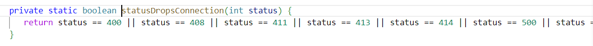
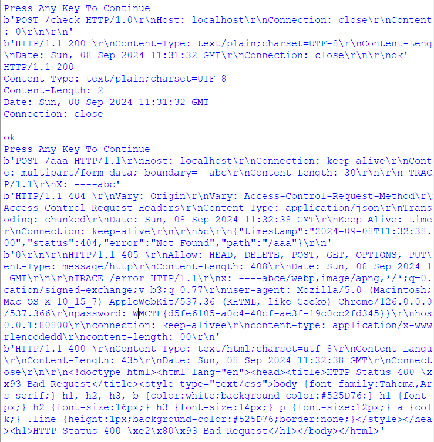

# 【 ? 】Tomcat vs HTTP/1.1

本题在 CTF Web 题中也算比较难的类型，并没有让大家做出来的打算。算是让大家见识见识吧。

很纯真的一道题，代码里什么都没有，只是把 flag 放在请求头里另外访问了一个不存在的路由，而且这个过程中没有任何用户可控的输入。


有点像 HTTP 缓存投毒，但是这里没有中间件，flag 也不在回显里。从 CTF 题的角度来考虑的话，最有可能的选项是：先前 HTTP Header 的信息以某种形式被缓存了，并且可能可以在后续的请求中被泄露出来。

想到这里，就得先翻翻 Tomcat 的 CVE 列表。

https://security.snyk.io/package/maven/org.apache.tomcat.embed:tomcat-embed-core/9.0.43


然后找到了非常可疑的 CVE-2024-21733，再一看 PoC，基本上可以确定就是它了。

运气很好地搜到了下面的分析文章。

https://mp.weixin.qq.com/s?__biz=Mzg2MDY2ODc5MA==&mid=2247484002&idx=1&sn=7936818b93f2d9a656d8ed48843272c0

总结一下：

1. Tomcat 在 org.apache.coyote.http11.Http11Processer#service() 处开始处理 HTTP 请求，而从 socket 中读到的数据存放在 Http11InputBuffer (内部是 ByteBuffer) 里。该实例在每个执行线程中都是持久的，即，通用的。
2. ByteBuffer 有 pos、limit、capacity 等参数，处理新的 HTTP 连接前初始化为 0，完毕后也会 GC 。
3. 出于对 HTTP/1.1 Keep-Alive 的支持，service() 函数循环处理 ByteBuffer 中剩余的 HTTP 请求，即通过 pos 参数来分别(并解析)同个连接中可能的多个 HTTP 请求。
4. ByteBuffer 中的数据是不清空的，这一点很好理解；即新的数据直接覆盖在旧的 buffer 上，通过 limit (数据大小) 来控制边界。

想到这里，或多或少可以猜到：既然请求数据 buffer 不清空，还能循环处理，是不是可以通过某种方式"越界读"，在新的 HTTP 请求中将之前剩余的信息提取出来？

为了实现这一点，关键是 limit 参数。如果无法控制 limit 参数的话，那无论怎么解析，都只会是在当前的请求内，无法造成"越界"。另一个关键点是"循环"，在 service() 函数中，进行循环处理的条件有两个：`!this.getErrorState().isError() && this.keepAlive`，即解析上一个请求时没有发生错误，且 keepAlive=true 。keepAlive 比较好解决（真的吗？），因为 HTTP 版本设为 1.1 时其值默认为 true，Connection: keep-alive 也能将其值再次设为 true 。


CVE-2024-21733 以一种巧妙的方式串起了整个攻击链。根漏洞点位于 Http11InputBuffer 的 fill() 函数：


该函数在解析 HTTP 头的过程中，或读取 POST Body 时被调用，其尝试读取 socket 中的剩余数据，总共最多 capacity 个字节，至当前的 pos 后。为了实现这一点，代码使用了先 mark() 当前 pos，后 limit() 至 capacity，读取，最后重置 limit 为 pos，pos 为 mark 的做法，乍一看是没啥问题的，因为异常处理确实是在恢复 limit 之后才进行。


但是再仔细一看，socketWrapper.read() 竟然能 throws IOException，具体来说，就是当 socket 长时间无数据，超过 server.tomcat.connection-timeout (60 秒) 时，会抛出一个 SocketTimeoutException 。这样的话，那一切就完了，buffer 的 limit 没有被设回来，保持在最大值，也就相当于在之后的处理中造成了"越界读"！其实修复补丁很简单，就是将重置 limit 的这一行放在 finally 里完事。

也就是说，我们已经解决了第一个关键点。只要在 Tomcat 调用 fill(true) 函数尝试获取更多的数据时，保持 socket 连接什么都不发送，等 60s 后触发 SocketTimeoutException (IOException) 即可实现 limit 越界。

其实 service() 函数本身在默认 this.endRequest() 尝试移动至下一请求时就会调用 fill(true) ，当存在 POST body 时，移动的大小由 Content-Length 决定，那是不是说对于随便一个请求，只要构造一个过长的 CL，当预期读到更多数据我们什么都不发送，就完事了？Actually no.


这样确实能触发"越界"，但要利用"越界读"的另一个要点是"循环"。正如先前提到的，在解析上一个请求时如果发生错误，那 service() 函数将跳出循环，不再继续解析，即使在当前请求中"越界"了也没有用，因为跳出循环后就直接 GC 了，没有"读"的地方！


看了好几个小时，我几乎可以确定在 service() 函数处理请求头时所有对 fill() 的调用都会被 try - catch 起来，并且设置 errorState，也就是说无法利用！

CVE-2024-21733 则是很巧妙地借助了 org.apache.catalina.connector.Request#parseParameters() ，该函数在原生 request.getParameter() 或 Springboot 路由存在 @Param 类注解时被调用；其在 HTTP METHOD 为 POST 时会尝试解析 POST body，而读取 body 的过程中正是调用了 fill() 。


readPostBody() 会循环调用 fill() 直至缓冲区中至少存在 Content-Length 大小的 body。

再仔细一看，这里竟然有个 try - catch 处理了 SocketTimeoutException，并且只是设置了参数处理失败原因，而对路由整体的上下文没有任何影响，也就是说，对循环没有影响！

至此我们可以还原出 CVE-2024-21733 的攻击链：

1. 调用存在 getParameter() 的路由为触发点；
2. POST 时 Content-Length 比实际发送的数据大，并且保持 socket 连接；
3. fill() 函数抛出 SocketTimeoutException，limit 越界，但 HTTP 请求正常处理；
4. service() 函数循环继续处理下一个可能的 HTTP 请求，此时已经越界，读到的是 CL 大小之后，原本在 ByteBuffer 里的，该线程上一个 HTTP 连接发送的数据；
5. 此时，非法的 HTTP METHOD（作为泄露的数据）以 Error Message 的形式回显给攻击者。

到这里虽然很激动，跃跃欲试，但遗憾的是在本题里：

1. 没有具有 @Param 注解的路由。Tomcat 对于请求参数，包括 POST body，是 lazy processing 的，也就是说只有在第一次显式调用 getParameter() 时才有机会触发 fill() ，而本题中是没有的。
2. 没有 message 回显。Springboot 默认不会把 Invalid HTTP Method XXXXX 打印出来，而只是返回 400 Bad Request，没有任何额外的信息，也就无法以先前的方式泄露数据。

先来解决第二个问题。经过一番搜索后我发现，Springboot 竟然默认支持 HTTP TRACE 。这好像是一个 bug：

https://github.com/spring-projects/spring-boot/issues/33623

不管如何，使用 TRACE 就可以把越界的内容当做 HTTP 请求头回显出来，再想想，flag 被放在 HTTP Header 而不是 POST Body 里是有这么一份道理的。虽然后者的情况，我们也可以通过控制 Content-Length 吞掉合适大小的数据，从而将其伪造成 HTTP Header。

头疼的是第一个问题。我本来想寻找其他地方有没有隐含着 getParameter() 的触发，但是无果。

想到 POST 数据，除了 application/x-www-form-urlencoded，另一个经典的就是 multipart/form-data 。有没有可能 Tomcat 会自动解析使用 multipart 传上去的东西？还真是。


这么长一串调用链，从默认的 org.springframework.web.servlet.DispatcherServlet 走到 Request.parseParts()，借由 org.apache.tomcat.util.http.fileupload.MultipartStream 以另一种方式触发读取 POST body 的功能，最终走到 fill() 。

怀着忐忑的心情让它继续跑，然后下断点观察是否触发越界读。嗯？竟然没有？怎么回事？

看了一眼，发现 this.keepAlive 怎么变成 false 了？虽然由于不完全的 multipart body，servlet 里抛出了异常，但这并不会影响 service() 函数里的 errorState（因为在调用链中间由 org.apache.catalina.core.StandardWrapperValve#invoke() 处理了，其会把 HTTP Status Code 设为 500，并赋值 request 上下文相关 exception 的属性）。


但是 HTTP 500 又怎么了？代码跑到 Http11Processer.prepareResponse() 之后，里面有惊人的一行：




它竟然把 keepAlive 弄成 false 了！！也就是说，servlet 抛出异常 => 500 => keepAlive=false => 无法继续循环，这条路子竟然走不通！！

之前已经在 errorState 上吃过一回闭门羹了，现在又整了 keepAlive 这出。也就是说，我们的触发点还必须使用 try - catch 捕获 fill() 的异常，并且返回 HTTP 200 。

然后找到了另一个 org.springframework.web.filter.FormContentFilter 默认启用的 filter，其在 PUT application/x-www-form-urlencoded 时能触发 fill(true) 。


可惜的是，这里还是没有 try - catch，依旧 HTTP 500 。

大半夜看得头疼，山穷水尽之际，来自出题人充满的善意 hint 告诉我跟 HTTP POST File 有关系。难道我们在 multipart 那里看漏了什么很重要的东西么？

一层层回溯调用栈，尝试寻找线索。我们之前触发 fill() 是通过下图中 discardBodyData() 里的 readBodyData()，我将 POST body 设为一个 "R"，并令 CL=2 。


可以发现，这里对 MalformedStreamException 进行了处理，但 SocketTimeoutException 作为 IOException 直接抛向了上层，符合 debug 结果。

那么问题出在哪儿呢？看到底下一行的 readBoundary() ：


很明显，this.readByte() 最终调用的也会是 fill() ，而这里的 try - catch 竟然把 IOException 包装成了 MalformedStreamException ！！也就是说，我们如果能在这个地方触发 fill() ，那将不会在上层抛出异常，是一个理想的触发点！

那么一个新的问题又产生了，这里的 readByte() 可能被阻塞吗？我之前测试的时候陷入了一个大坑，就是我以为上边 discardBodyData() 里调用的 readBodyData() 跟先前提到的 getParameter()、endRequest() 以及 FormContentFilter 是一样的 —— 读取完 Content-Length 长度的整个 Body 才会返回。

因为美丽的 VSCode 找不到这其中一个关键部分的源代码：


而且我先前测试的 Body 并不是合法的 Multipart 格式。

动态调试后发现在 ItemInputStream 里进到了 findSeparator()


并且 fuzz test 后发现，再根据名字猜一波，readBodyData() 并不要求读取全部长度的 Body，而只是停在 ----boundary 这个 token 之后！！之后的 readBoundary() 也是如其名，检测接下来的两个字符是否为 CRLF 或 -- 结束标志。

此为攻击链中最后一块缺失的拼图。PoC 其实简单得不能再简单了：发送 ----boundary 然后等待即可。readBoundary() 感觉少东西了，自己会调用 fill() 读取。

剩下的 TRACE 请求构造就显得不那么复杂，不管是 fuzz test 还是直接根据代码算 pos，可以得出 Content-Length 多出多少就吞掉 POST body 前多少个字符的规律，所以：

```
POST /aaa HTTP/1.1
Host: localhost
Connection: keep-alive
Content-Type: multipart/form-data; boundary=--abc
Content-Length: 30

?TRACE / HTTP/1.1\r\nX: ----abc
```

还真是神奇，我们经历了这么多，得到的 PoC 却是此般的短。

总结一下：

1. 发送恶意构造的 multipart 的 "XXXX----boundary" 请求体，由 Springboot 自动调用在 org.apache.tomcat.util.http.fileupload.MultipartStream#readBoundary() 处进入 fill()；
2. 保持 socket 连接，fill() 抛出 SocketTimeoutException，当前线程中 ByteBuffer 的 limit 被错误配置，造成越界读；
3. org.apache.coyote.http11.Http11Processer#service() 由于 keep-alive，在越界读的数据上继续解析，该数据为先前包含 flag 的请求；
4. 构造合法的 TRACE 请求以回显。

为了使 flag 均匀分布在各个执行线程的 ByteBuffer 中，可以先多线程简单地并发一下 /check 路由。

```python
import socket

REMOTE = ('IP', PORT)

def connect(poc, persist = False):
    s = socket.socket(socket.AF_INET, socket.SOCK_STREAM)
    s.connect(REMOTE)

    poc = poc.replace(b'\r', b'').replace(b'\n', b'\r\n')
    
    print(poc)
    s.sendall(poc)

    response = []
    while True:
        data = s.recv(1024)
        print(data)
        if not data: break
        response.append(data)
        if not persist: break
    data = b''.join(response).decode().rstrip()

    print(data)

    s.close()

import requests, time, threading
def req():
    try:
        print(requests.post(f'http://{REMOTE[0]}:{REMOTE[1]}/check', headers={'User-Agent': '', 'Accept': '*/*', 'Accept-Encoding': '*'}).text)
    except:
        pass
for _ in range(200): # If not working, increase requesting attempts
    threading.Thread(target=req).start()
    time.sleep(0.1) # Adjust based on your actual RTT

input('Press Any Key To Continue')

poc = b'''POST /check HTTP/1.0
Host: localhost
Connection: close
Content-Length: 0

'''
connect(poc)
input('Press Any Key To Continue')

poc = b'''POST /aaa HTTP/1.1
Host: localhost
Connection: keep-alive
Content-Type: multipart/form-data; boundary=--abc
Content-Length: 30

 TRACE / HTTP/1.1\r\nX: ----abc'''
connect(poc, True)
input()
```

