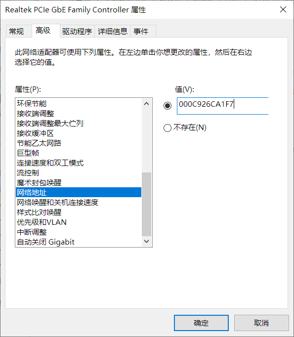

#  (3/3) 校内 IP 集邮

## 【困难】通往 IP 真神的道路......

该系列作为 **“校园网” 系列**的第一套，旨在引导大家对身边网络环境的探索。实际上，效果比预期要好得太多了，甚至出现了我都未曾注意到的解法。

25 个 IP 其实是经过深思熟虑的。一个设备在正常操作下最多能刷 7 个 IP（关闭 MAC 地址随机，开启 MAC 地址随机，三个 WiFi： NEU  NEU-2.4G  NEU-Mobile），三个设备最多也有 21 个，还差一点儿。

熟悉网络协议的朋友们，在看到这里，能够秒想到利用 MAC 地址更换来刷 IP，应该是比较自然的。现代网卡以及操作系统都提供了**更换 MAC 地址**的方法，例如，Windows 则是在下面的地方：



Linux 更是一行简单的命令就完事了 ```ip link set address 00:8c:91:3a:b7:00``` 。

这个方法在所有的网络环境中都是**通用**的，不管是 Wired/Wireless ，因为只要换了 MAC，在交换机以及 DHCP 服务器来看你就是台新的设备，自然得给你分配新的不重复的 IP 地址。当然这里不涉及到 DPI 等技术检测手段，咱们学校没有此类的限制。

所以**预期的解法**是，只需要连接上任一网络（有线/NEU/NEU-2.4G/NEU-Mobile）然后一直更换（实测手换比写脚本快）MAC 地址，再访问容器打卡即可，手速快的话半小时内就可以搞定。容器里的网页还特地缓存了 googlefonts、jsdelivr 等 CDN 资源，方便你在不出外网的时候访问，出题人简直是太贴心了！

相信有一半左右的同学是采用了如此朴素的做法。我知道肯定有人会好奇，问为啥不直接自己改 IP 呢，非得通过 DHCP 服务器给你分？

实际上，在有线网的环境，这么做是**连不出楼层交换机**的。因为咱们学校有线网（宿舍、实验楼、部分教学楼）分的全是**公网 IP** ！真够大气的，所以说防护措施相对应的会严格。

有线网的环境里，起作用的主要是 **DHCP Snooping**（拒绝未经授权的 DHCP 服务器）、Dynamic ARP Inspection（阻断 ARP Spoofing）以及 **IP Source Guard**（拒绝未经授权的 MAC-IP 地址对接入网络）。这确保了自己改 IP 地址绝对是出不了网的，只能通过 DHCP 服务器下发。但有线网在不登录 ipgw 时可以访问校园内网，且 **IPv6** 更是直接可以出网的，因为其通过 **SLAAC 自动分配**，也没有任何防护，实际上你更可以挑选一个“靓号”使用。（当然我们并不推荐你这么做，你也别把我供出来！）


无线网的网段集中在 172 这个 Private IP 段内，这是一个重大的非预期。考虑到无线网每次更换 MAC 地址都需要重新登陆 ipgw，实在是麻烦。并且 **NEU / NEU-2.4G** 是开启了 IPSG 的，也就是说在登陆 ipgw 之前也无法访问校内网站，经测试，更换 IP 之后虽然能访问 ipgw，但**无法认证成功**，也就无法访问容器环境。

问题出在 **NEU-Mobile** 这个地方。由于它采用 802.1X ，在连接时就已经提供用户名密码，所以连上去之后不用自己登 ipgw 就能出网。 由于 AP 的特殊性质，**Client Isolation** 很好解决，而且出网是 NAT 的，内网 IP 想怎么发就怎么发。查看了选手们提交的 wp 之后，我才发现，原来 NEU-Mobile 里的 IP 是可以**随便改的**，并且改完之后还是能出网，正常访问容器环境！！这说明 802.1X 认证模块跟 ipgw 的认证模块不是放在一起的，我都感觉是被同学们找出校园网的设计缺陷了。其实类似的问题在五六年前就出现在了三大运营商的内网当中，当时流行一种说法叫“免流”，由 CTWAP 的 APN 上网的时候，可以访问到一个内网的代理服务器叫 10.0.0.200，通过该 HTTP 代理可以上外网。问题同样出在，这个代理服务器跟运营商的计费服务器不是放在一起的！！也就是说，我们可以通过某种方式，借助它俩对于 HTTP 请求的解析差异，例如经典的 X-Online-Host 法、双 Host 法、CRLF 法等，使代理服务器访问我们真实的网站，但计费服务器却认为是在访问运营商内部网站，所以免流！

对于 **WebVPN** 或者 **SSLVPN**，由于它仅在校内有几个固定的 IP，对于 25 个来说肯定是杯水车薪。

另一个问题出在 **OpenVPN** 上。一年多前我测的 OpenVPN 当时的 IP 缓存在 3~5 分钟，也就是说，用你的账号连上去之后，得断开连接，再等上个几分钟，才有办法刷到新的 IP。搭过的朋友应该知道，一行 ```ifconfig-pool-persist``` 就可以实现这个功能了。我一想啊 25*3 = 75 不得把大家硬控在手机电脑前一个多小时，也就算了。看到了选手们提交的 wp 才知道，这机制现在改了，一直点**重连**就能**刷出新 IP** 来，虽然有几率重复，我看选手们有的运气好的刷得特别快，也算1/4个非预期了其实。再说一句题外话，这个短信认证 MFA 的功能其实是咱们 NEX 上几届的学长提供的 :)

还有一个我没想到的小技巧，就是选择使用随机 MAC 连接 WiFi，然后**忘记网络**，然后再连，然后再忘记，还真比自个儿填 MAC 地址快。

在这些因素的加持下，本题也成功成为解出人数最多的困难题。真是令人**受益匪浅**！

