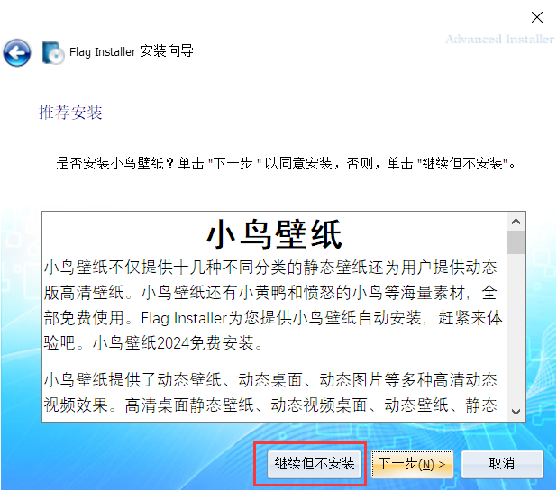

# 【简单】Flag Installer

出题组为了给大家整点简单又好玩的题，可谓是费劲了心思。在 [软件下载站] 跟 [高速下载器] 当中选择了后者——于是便有了本题 **Flag Installer**，模拟一个真实软件的安装过程。

本 exe/msi 采用 Advanced Installer 制成，甚至能向下兼容到 Win 7 系统，在配色方面也选用了类似的主题 Sky Blue，可谓是煞费苦心。

**坑点1：** 这里需要点 **[继续但不安装]**，手速比眼睛还快一不小心点到下一步的话就完了。

**坑点2：** 这里需要选择 **[自定义]** 安装，至于为什么，接下来就知道了。

**坑点3：** 需要把这里的 **推荐安装勾掉**。这下知道为什么上面要选 [自定义] 了吧，因为它是默认安装！

**坑点4：** 这里的 **快压千万不要勾起来**。虽然它默认就是不勾的，但不能排除有人连看都不看，直接把扩展功能全勾上了！

**坑点5：** 这俩 **必须要勾掉**！在一堆的选项当中，它们额外显眼。

**坑点6：** 同样，点 **[继续但不安装]** 。有些人就是手比眼睛快，可能意识到的时候已经点下去了，哈哈。

**坑点7：**左下角的这玩意儿最坑人，**一定要勾掉**！国产软件就喜欢搁这些角落玩小动作。

注意以上所有的坑点，便可以顺利得到 Flag 的**前半部分**：

顺带附一张大满贯 :)

那后半部分呢？题目说需要继续安装以获得，那么就安装。到达这个画面，说明安装完了。

但是这时不管点啥，它都只告诉你 "安装成功"，没有别的信息。

作为一名合格的计算机使用者，我们需要学会查看它到底**安装了什么东西**进去。还记得先前有一个选择**安装目录**的选项吗？Flag Installer 的所有内容便被安装于此地。我们找到这个地方。

如果前面没有把 Hint 安装功能勾掉的话，这里会出现一个 hint.txt，其内容为 “*你仔细看过每一项待安装功能的描述了吗？*”

这时候再仔细看看，发现还真有蹊跷。这个 **AccessDB** 功能项的描述明确告诉我们，Flag 的后半部分在 **flag.mdb** 里。

把它勾起来再安装一遍（当然需要先卸载之前的 :），你就能拿到 flag.mdb 在你的硬盘里。

如果安装有 Office 套件的话，直接用 Access 或者 Excel 就可以打开了。

没有的话呢也没关系，随便搜一个在线网站也能打开，例如 https://www.mdbopener.com/ 。

合起来就是：NEX{c820477d_Very_D@nger0Us_tO_1nstaLl_A_SOftW2r1_108e774d9376}

Very Dangerous to Install a Software!!
