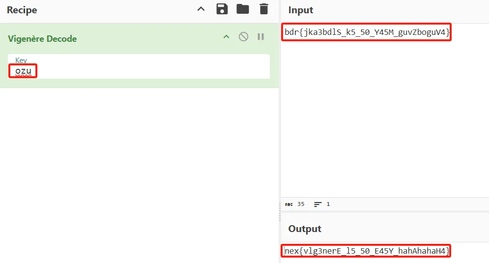

# 凯撒超进化
这题主要是想让大家了解一下密码的发展历史，大部分人对凯撒比较了解，那凯撒之后是什么呢，典型的就是本题的**维吉尼亚**了。 
```  
bdr{jka3bdlS_k5_50_Y45M_guvZboguV4}
```  
## 爆破
相信大部分人都是这么干的，密钥长度设置为三位就是方便大家这么干的。找个在线网站然后一位一位的试，试出来密文为nex时,flag就有了。    


## 非爆破
由于提示了flag前三位是nex，将密文的前三位bdr减去nex即可得key:  
```
b - n -> o  
d - e -> z  
r - x -> u
```      
然后用key上在线网站解密即可得到flag  

---  
