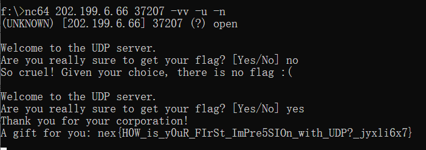
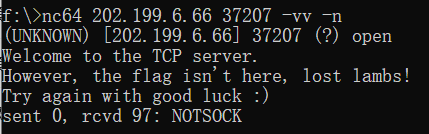

# (1/3)  敲开 UDP 之门

## 【简单】初识 UDP

出题组为了给大家整点简单题，可谓是费劲了心思。本来只放最后一道 NAT 就可以了，善良的出题人还是想尽一切手段多整出来俩，一个正向连接一个反向连接。

这题呢很显然要求大家使用 UDP 协议**正向连接**至容器的端口。

我看提交上来的 wp，大多数同学使用了 python，这当然是没问题的。实际上有一个更简单的工具，**nc (netcat)**，也在文档站中给予大家很多次的提示了，nc 用来简单收发包是最快的。

Python 代码大家问 AI 也都写得出来，nc 的话呢，一行命令就完事。

如果不加 "-u" 就会默认连接到 TCP 服务器，迷失的羔羊！

