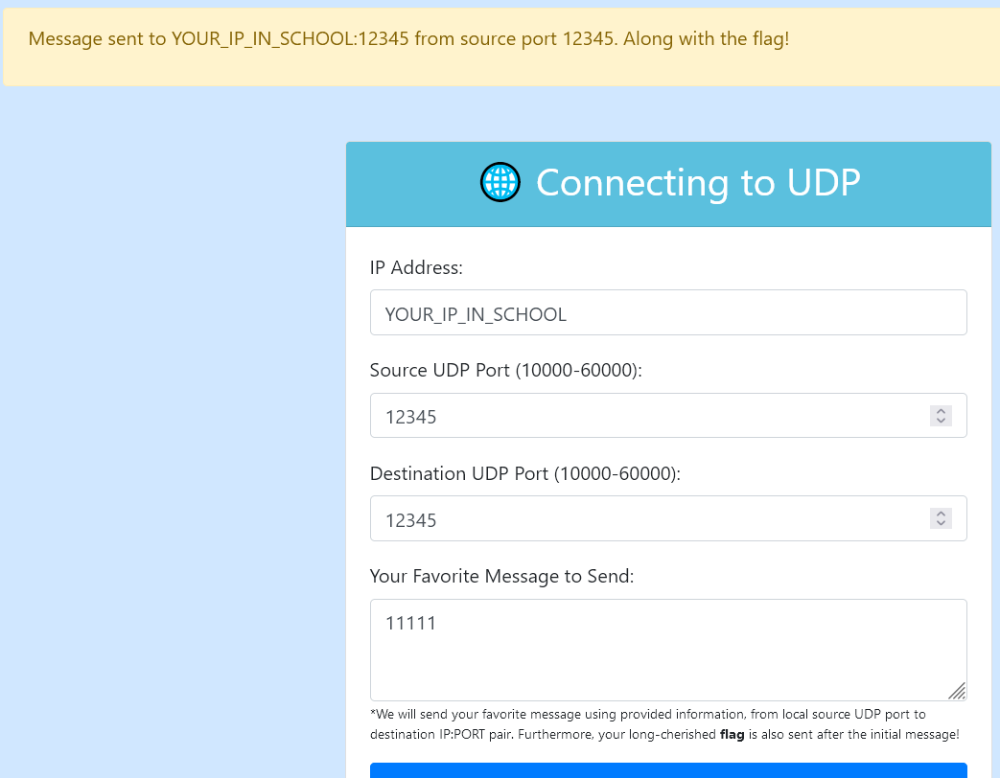
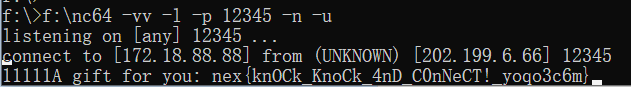

# (2/3)  敲开 UDP 之门

## 【中等】列出你的端口清单

出题组为了给大家整点简单题，可谓是费劲了心思。本来只放最后一道 NAT 就可以了，善良的出题人还是想尽一切手段多整出来俩，一个正向连接一个反向连接。

这题呢很显然要求大家使用 UDP 协议在本机监听端口，供容器里的应用程序**反向连接**。

我看提交上来的 wp，大多数同学使用了 python，这当然是没问题的。实际上有一个更简单的工具，**nc (netcat)**，也在文档站中给予大家很多次的提示了，nc 用来简单收发包是最快的。

Python 代码大家问 AI 也都写得出来，nc 的话呢，一行命令就完事。

实际上，善良的出题人还为本容器环境提供了外网访问，大家使用公网服务器或者在线的 UDP 服务也是可以的。

在选手交上来的 wp 中，我还发现有使用 wireshark 抓包 UDP 流量的，当然也可以，那就不用监听也不用管防火墙了，随便发就完事。
