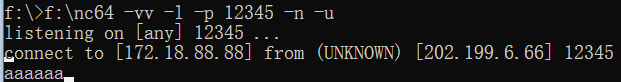
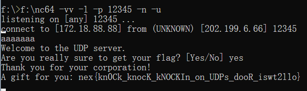

# (3/3)  敲开 UDP 之门

## 【困难】通往 NAT 的阶梯

本系列应该是作为 **“校园网” 系列**的第二套，刚开始是想考察大家有关 IPv6 的知识，引导大家对自己电脑上 IPv6 的探索。后来发现这个题确实不太好出。你说考协议吧，这未免门槛有点儿高，而且最关键的是，目前的比赛环境（docker）在搭建的时候没有考虑 IPv6 的扩展，一来二去，最后就换了个方向，考察 **Connection tracking** 相关知识，也就是本题的 **UDP 打洞**。

本题其实也是紧密结合校园网环境的。我见过有同学抱怨，你说网口都分公网 IP 了，咋还整个**入向防火墙**呢？那跟分内网 IP 有啥区别？接着看下去，你就会明白了。

**NAT** 呢顾名思义，**网络地址转换**呗。给你分的 172 打头的内网 IP，经过 NAT 设备或者说边界路由器，它帮你把源 IP 换成 210 开头的公网 IP 发送到互联网世界中（**SNAT**），然后收到回包时，再进行相反的转换（目标 IP 由 210 转换至你的 172），并转发。原因很简单，如果不给你转换，172 打头的内网 IP 发到公网当中会被过滤，而且就算成功到达了目标服务器，它也不知道咋把包回给你，全世界有那么多 172 打头的内网 IP，而路由是单向且非对称的！

NAT 有很多种类型，这里不进行详细介绍，我们主要关注 **Full Cone（锥形）** 和 **Symmetric（对称）** 这两种。

**Full Cone** 又被称作 **1:1 NAT**，一个内网 IP1 与一个公网 IP2 一一对应，由内网 IP1:PORT 发出的流量会被直接映射到公网 IP2:PORT，反之亦然。这种 NAT 类型其实相当于给了公网 IP，只不过在你网卡上体现的是一个内网 IP，多见于大厂的云服务 Virtual Cloud Network（或者类似的名称）。可以发现，这种 NAT 类型是 **Stateless** 的，IP1 与 IP2 的所有端口完全对应，从互联网上的流量，可以直接通过 IP2:PORT 访问到 IP1:PORT 。

而与之相对，**Symmetric** 具有将多个内网 IP 映射至仅仅数个公网 IP 出口的能力，这就丢失了上面 IP:PORT 的双向对应性质，因此需要维护一个 **Connection tracking 表**，也被称作 **Stateful NAT** 。其要求内网客户端**主动对外**发起连接，然后 NAT 设备维护源 IP1:PORT1，并为其分配对应出口 IP2:PORT2 且**建立映射**，此后，从源请求的公网地址发向 IP2:PORT2 的数据才能到达 IP1:PORT1，若没有该条映射，则外部网络将永远无法访问到 IP1:PORT1 ；这样的映射关系在 Linux 系统中可以通过 ```conntrack -L``` 命令查看。

咱们学校的入向防火墙，其实与 Symmetric NAT 的本质是一样的（更准确的说，在大部分不冲突的情况下为 Port Restricted Cone NAT，当然最重要的特性是 **Address and Port-Dependent Filtering**），其阻断一切外来请求，除非该连接是从内部主动建立的。

题目环境实际上相当于模拟了该种入向防火墙，而你充当了“公网服务器”的角色，需要想办法连接到运行在内部的 UDP 服务器。

这样的操作被称作 **UDP 打洞**。为什么本题不使用 TCP 的原因是，TCP 三次握手四次挥手，考 408 或者背过八股的同学应该很熟。TCP 打洞的过程中，由于握手时需要三个完整的状态变迁 SYN  SYN+ACK  ACK，所以只能保证单方向连接的建立；而由于 UDP 是无状态的，一个包过去打通之后产生的信道可以被视作**双向**。

说了这么多，所以本题到底该怎么解决呢？不知道有没有同学尝试起一个 UDP Server 然后直接在 Connect 界面跟 127.0.0.1 交互，但是很遗憾，这种方法已经被我 ban 掉了，回显里不会出现 flag 。

由于该 UDP 服务器监听在容器的内部网段，并且唯一对外的 Port-mapping 是 80 端口，所以默认情况下根本没有办法访问监听在这里边的 UDP Server 。善良的出题人也给了大家 **Info 界面**，通过 IP 信息以及 Traceroute 结果应该可以发现并印证这一点。

别忘了，还有个 Connect 主动发包的功能。如上所述，UDP 是无状态的。我们使用内部 IP1:SPORT 向外 IP3:DPORT 发送信息时，会在 NAT 设备（在这里就是题目环境外边的 Linux）上创建一条 **(IP1, SPORT) => (IP3, DPORT)** 的映射，且记录 **(IP2, MPORT)** 为该连接的 NAT 信息。我们尝试用 SPORT 12345 向 YOUR_IP:12345 发一条 UDP 信息，然后看看 conntrack 的结果：

```
$ sudo conntrack -L -j | grep 12345
udp      17 26 src=10.0.230.98 dst=YOUR_IP sport=12345 dport=12345 [UNREPLIED] src=YOUR_IP dst=202.199.6.66 sport=12345 dport=12345 mark=0 use=1
```

可以发现，10.0.230.98 就是容器环境的 IP，而由 **(10.0.230.98, 12345) => (YOUR_IP, 12345)** 的记录已经出现在了其中，且该连接的 NAT 信息，由于 Linux 内核的设计，体现在回包的部分，即允许 **(YOUR_IP, 12345) => (202.199.6.66, 12345)** 的传输。这时候又可以想想了，如果我们现在往 202.199.6.66:12345 发包，它是不是就会把该内容转发至容器内的 12345 端口了呢？答案是肯定的，这就是 NAT 的工作原理。

所以说，本题其实非常简单：

1. 在你的机子上**监听** 12345 端口，为了查看创建的 NAT 映射规则；
2. 在 Connect 界面使用源 12345 端口朝你的 IP:12345 端口**发包**；
3. 
4. 得到 **IP2:MPORT** 为 202.199.6.66:12345 ；
5. 在 Listen 界面**监听** 12345 端口；
6. 使用你的 IP:12345 往 202.199.6.66:12345 **发包**。如果你使用步骤 3 的 nc 指令，直接按下**回车**即可。但要注意手速不能太慢了，上面 conntrack 显示的结果中第三栏表示该项的过期时间为 26s 。
7. 
8. 简简单单 **Flag 到手**。

通过查看选手们的 wp，解出本题的同学均表示：难度应该改成【简单】，秒出。

虽然解出人数只有 5，让我觉得还是能令大家受益匪浅。
